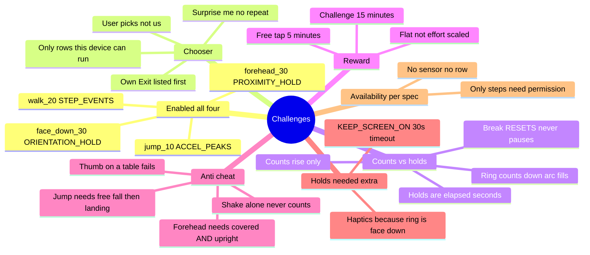

# Challenges

← [[ScrollKiller]]

The block is never just a wall — there is always a way to earn past it. Four physical challenges,
all worth the same 15 minutes, and the user picks.

## Mind map

## Why each one exists

| Challenge | Its job in the set |
|-----------|--------------------|
| **Walk 20** | Gets you off the sofa. Needs a room and a pedometer |
| **Jump 10** | Genuinely aerobic. Needs no permission and four square feet — works where walk can't |
| **Face down 30s** | Asks for nothing physical. Works in a lecture, on a bus, at 2am. The only one you can't do while still watching the reel |
| **Forehead 30s** | Deliberately absurd. A moment of "what am I doing" interrupts a trance harder than counting does |

Choice is about **accessibility, not optimisation** — which is why the reward is flat. Someone who
picks the easy one because they physically cannot do the others must not be paid less for it.

## Shape

`ChallengeSpec` (data) → `ChallengeSensors.sourceFor` → a `ChallengeSensorSource`, with a **pure
detector** beside each thin sensor half (`JumpDetector`, `HoldDetector`). `ChallengeRegistry.IMPLEMENTED`
is the gate: a spec naming an unbuilt strategy fails the build rather than shipping a challenge that
can never complete.

Holds cost two things counts did not — the screen must be held awake (a default 30s timeout is
exactly the hold length, and a sleeping screen stops the sensor) and haptics are the only feedback,
because a face-down ring points at the table.

Related: [[Overlay and Block]] · full audit in `docs/PROJECT_MAP.md`

#challenges
