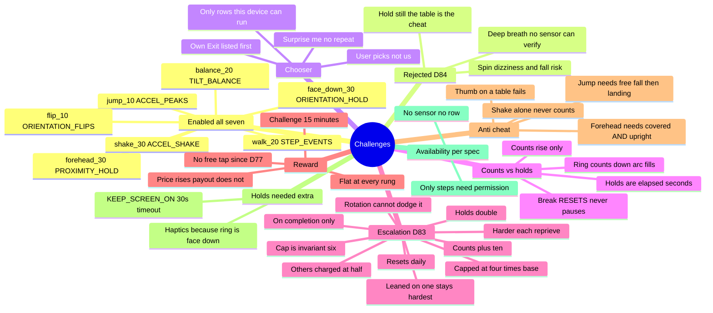

# Challenges

← [[ScrollKiller]]

The block is never just a wall — there is always a way to earn past it. **Seven** physical
challenges, all worth the same 15 minutes, and the user picks. Since D77 a completed challenge is the **only**
reprieve, so it carries the entire price of buying time — which is why the targets now **escalate**
each time one is used (D83).

## Mind map

## Why each one exists

| Challenge | Its job in the set | Escalates |
|-----------|--------------------|-----------|
| **Walk 20** | Gets you off the sofa. Needs a room and a pedometer | 20 → 30 → … → **80** |
| **Jump 10** | Genuinely aerobic. Needs no permission and four square feet — works where walk can't | 10 → 20 → 30 → **40** |
| **Face down 30s** | Asks for nothing physical. Works in a lecture, on a bus, at 2am. The only one you can't do while still watching the reel | 30 → 60 → **120s** |
| **Forehead 30s** | Deliberately absurd. A moment of "what am I doing" interrupts a trance harder than counting does | 30 → 60 → **120s** |
| **Shake 30** | Effort you can deliver sitting down, in silence, in a shared room. The first one that's tiring *and* available everywhere | 30 → 40 → … → **120** |
| **Flip 10** | Attention, not exertion. You can walk on autopilot; you can't turn a phone over ten times absent-mindedly | 10 → 20 → 30 → **40** |
| **Balance 20s** | The other holds let you wait and think about the feed. This needs continuous fine motor attention — any thumb pressure tips it | 20 → 40 → **80s** |

Choice is about **accessibility, not optimisation** — which is why the reward is flat, at every
rung. Someone who picks the easy one because they physically cannot do the others must not be paid
less for it, and must not be charged more for it either.

## Escalation (D83)

A static challenge gets absorbed. Walk 20 is a real interruption once and muscle memory by the
third block of the day, so the target grows each time that challenge buys a reprieve — counts step
by ten, holds double.

**The cap is the part to understand.** Everything stops at **4× its base**, and that number is an
invariant-6 device rather than a difficulty setting: a challenge nobody can finish is a reprieve
that does not exist, and "the only way to buy time is now impossible" fails the spirit of *the
block is always exitable* while keeping its letter. Holds stop at two minutes specifically because
breaking one **resets** it — failure probability compounds with length, and a four-minute hold
surrenders everything to one twitch at 3:59, with the ring pointing at a table.

Escalation is charged on **completion only** (backing out of the chooser costs nothing) and
**resets daily**, like the limit, the counts, the cadence and the streaks. It is applied in exactly
one place, so the row label, the prompt, the ring and the counter can never disagree about the
number.

### Rotation can't dodge it

A challenge is charged its **own** reprieves plus **one for every two** earned on any other. So
cycling through all four still raises the whole ladder — a full lap leaves walk 40, jump 30 and both
holds at 120s — while the one you actually lean on stays strictly hardest.

Pure per-challenge state was dodgeable. Pure *global* state closed the hole but pinned both holds at
their 120s cap from the second reprieve of the day even if you'd never done a hold, which deletes
the middle of every ladder. The split gets the closure without the collapse.

It also fixes a fairness problem that was easy to miss: rotation dilution was only ever available to
someone who can physically do several challenges. A user with no pedometer who can't jump in a flat
at 2am had one option and no discount at all. Charging part of every reprieve to the whole set makes
the rate the same for everyone.

## Device status (2026-08-03)

- Original four (walk / jump / face-down / forehead): **device-verified** earlier (D50/D53/D54/D55)
- Escalation arithmetic: **JVM-proven**; ⚑ **Run P ladder not yet run on hardware** — judgement call
  on walk-80 / holds-120s still open (`CAP_MULTIPLE` is the only lever if it reads as a wall)
- D84 three (`shake` / `flip` / `balance`): ⚑ **Run Q not yet run on hardware**

## Shape

`ChallengeSpec` (data) → `ChallengeSensors.sourceFor` → a `ChallengeSensorSource`, with a **pure
detector** beside each thin sensor half (`JumpDetector`, `HoldDetector`). `ChallengeRegistry.IMPLEMENTED`
is the gate: a spec naming an unbuilt strategy fails the build rather than shipping a challenge that
can never complete.

Holds cost two things counts did not — the screen must be held awake (a default 30s timeout is
exactly the hold length, and a sleeping screen stops the sensor) and haptics are the only feedback,
because a face-down ring points at the table.

## Three sensor traps (D84)

Worth not rediscovering, because each one looks like a tuning problem and is not:

- **A magnitude-based shake counter reads zero** no matter how hard you shake. `sqrt(x²+y²+z²)` never
  dips below gravity, because magnitude has no sign — there is nothing to cross. Gravity has to be
  estimated per axis and subtracted, using a filter *slower* than the shake (a fast one cancels it).
- **Shake's thresholds are absolute; jump's are fractions of gravity.** Not an inconsistency — jump's
  signal still contains gravity, shake's has had it removed.
- **"Level" must be measured laterally**, never as a Z floor. A fixed `z > 9.0` quietly means 17° of
  tolerance on one phone and 28° on another, because sensors aren't calibrated to 9.81.

## What we deliberately did NOT build

- **Deep-breath timer** — no sensor here can verify that anyone breathed. It would be a countdown you
  stare at, which is *worse* than face-down: that at least stops you looking.
- **Hold still** — a table is stiller than a hand, so the cheat is the intended behaviour. And "put it
  down and wait" is already face-down without the flip.
- **Spin / turn around** — escalation would reach four to eight consecutive rotations. Dizziness and a
  fall, at 2am, half-asleep, is a hazard the app can't see coming.

Related: [[Overlay and Block]] · full audit in `docs/PROJECT_MAP.md`

#challenges
