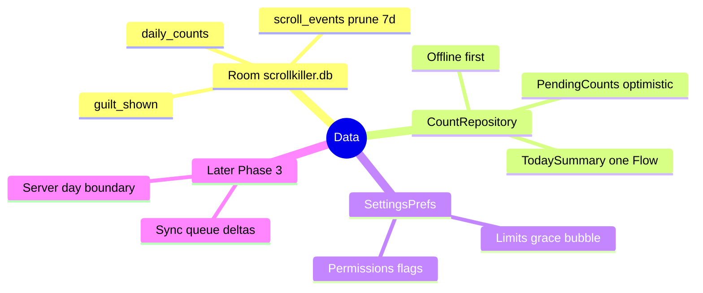

# Data

← [[ScrollKiller]]

## Mind map

```mermaid
mindmap
  root((Data))
    Room scrollkiller.db
      daily_counts
      scroll_events prune 7d
      guilt_shown
    CountRepository
      Offline first
      PendingCounts optimistic
      TodaySummary one Flow
    SettingsPrefs
      Limits grace bubble
      Permissions flags
    Later Phase 3
      Sync queue deltas
      Server day boundary
```

#data #room
