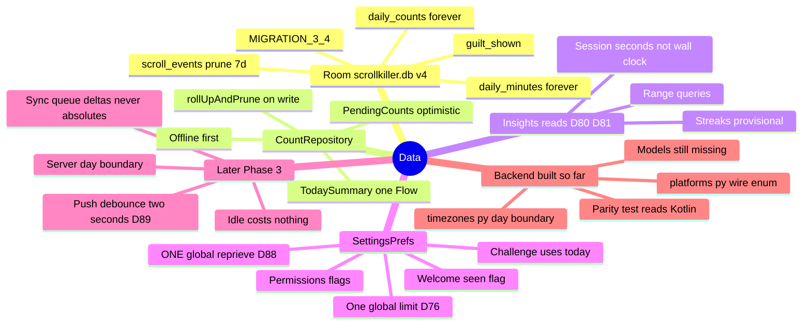

# Data

← [[ScrollKiller]]

Room is the source of truth on device. Server is a scoreboard later (Phase 3+).

> Synced **2026-08-04**: DB **v4** shipped (D80) — `daily_minutes` rollup before the 7d prune.
> Upgrade path device-checked on A015: v3→v4 migration + count survival PASS; rollup row still owed.
> **D88** moved the block reprieve out of per-platform keys into ONE global deadline.
> **D89** made server sync **near-live (~2s)** rather than a 60s batch.

## Mind map

## Tables that matter

| Table | Keeps | Note |
|---|---|---|
| `daily_counts` | forever | Untouched by v4 migration |
| `daily_minutes` | forever | Distilled from `scroll_events` **before** prune |
| `scroll_events` | 7d | Raw evidence; invariant 4 is not a tuning knob |
| `guilt_shown` | session history | Rotation / no-repeat |

## Device check (Run M / D80)

- Upgrade install (not fresh) is the only real migration test
- After upgrade: counts unchanged, `daily_minutes` listed in `.tables`
- After more scrolling + rollup: today's row exists, `seconds ≈ 6s × reels` (not wall-clock span)
- Clear all data must empty `daily_minutes` too

#data #room

## The reprieve is ONE deadline now (D88)

`SettingsPrefs` used to key the post-challenge grace by **platform**, which was right while each app
had its own limit and became a bug the moment D76 made the limit shared: do the exercise in
Instagram, open YouTube, get blocked again. One key now, and `graceUntilMs` no longer takes a
platform at all — see [[Overlay and Block]] for the full story.

## What actually leaves the device, and how fast (D89)

Counts. Only counts, never content — and as **deltas with a client-generated `batch_id`**, never an
absolute, so a retry cannot double-count.

The old plan batched every 60s and justified it as offline-first. That was wrong about one thing:
**you cannot doomscroll offline**, so the phone is connected at exactly the moments it has something
to report. Push is now a **2s debounce while a reel surface is active** — about one request per reel
at the app's own 6s/reel — and **idle costs nothing**, because no delta means no timer and no
request. Room stays the source of truth regardless; the app must keep working with zero backend,
forever.

