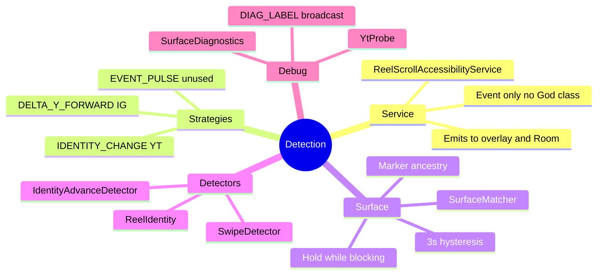

# Detection

← [[ScrollKiller]]

## Mind map

## Notes
- Entry credit on surface enter — **off** for YT (identity already counts landing Short)
- Package gate = `PlatformRegistry.forPackage` only
- See also [[Platforms]]

#detection
