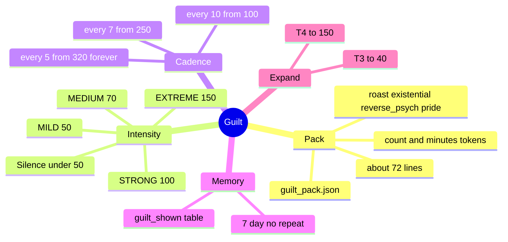

# Guilt

← [[ScrollKiller]]

## Mind map

```mermaid
mindmap
  root((Guilt))
    Pack
      guilt_pack.json
      roast existential reverse_psych pride
      about 72 lines
      count and minutes tokens
    Intensity
      Silence under 50
      MILD 50
      MEDIUM 70
      STRONG 100
      EXTREME 150
    Cadence
      every 10 from 100
      every 7 from 250
      every 5 from 320 forever
    Memory
      7 day no repeat
      guilt_shown table
    Expand
      T3 to 40
      T4 to 150
```

BrainState (mascot 50/150) ≠ GuiltThresholds (what we say) — keep separate.

#guilt
