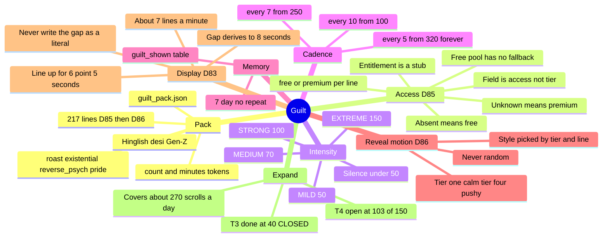

# Guilt

← [[ScrollKiller]]

## Mind map

## Premium, and the word we did not use (D85)

Lines carry `access: free | premium`. It is **not** called `tier` — that word already means the
*intensity* band (1–4), and the two are independent: there are premium lines at every intensity, and
a paid set clustered at the top would read as "pay to be insulted harder", which is the opposite of
the offer.

Two defaults, deliberately different:

- **No `access` field → free.** Every line written before the field existed is free content. That is
  a fact, not a guess, which is why all 72 original lines were left untouched.
- **An `access` we don't recognise → premium.** A tier we can't verify entitlement for gets
  withheld, not given away.

**The free pool stands alone.** Access is the one filter with no fallback — a free user can never be
handed a paid line to fill a gap, so "enough free content" has to be true of the content itself. A
test enforces it, including that a *free* PRIDE line exists at every tier: the way out is never
behind a paywall.

## Tier 3 is finished

Its band is finite — 100 to 149, firing every ten scrolls — so it can only ever burn five lines a
day, however hard anyone scrolls. Thirty-five covers a week for anybody; at forty it is closed for
good. Tier 4 has no ceiling and stays the open one — **103 free lines of the 150 target** after D86 added
sixty-two, which covers roughly a 270-scroll day (48 covered 200, the original 18 covered 160).

BrainState (mascot 50/150) ≠ GuiltThresholds (what we say) — keep separate.

## How long a line stays up (D83)

Five days of real use said the same thing daily: the line collapsed back to the count before it had
been read. An unread line was never shown — the pack, the tiers and the rotation all exist to serve
a line somebody finishes — so the display went **4s → 6.5s**.

The gap between lines is **derived** (`DISPLAY_MS + COUNT_VISIBLE_MS`), so it followed to 8s on its
own and no call site had to be found. That is the rule worth keeping: **never write the gap as a
literal.** The cost is frequency alone — about 7.5 lines a minute at the top of the curve instead
of 11 — and the *cadence* (which is measured in scrolls, not seconds) did not move at all.

#guilt
