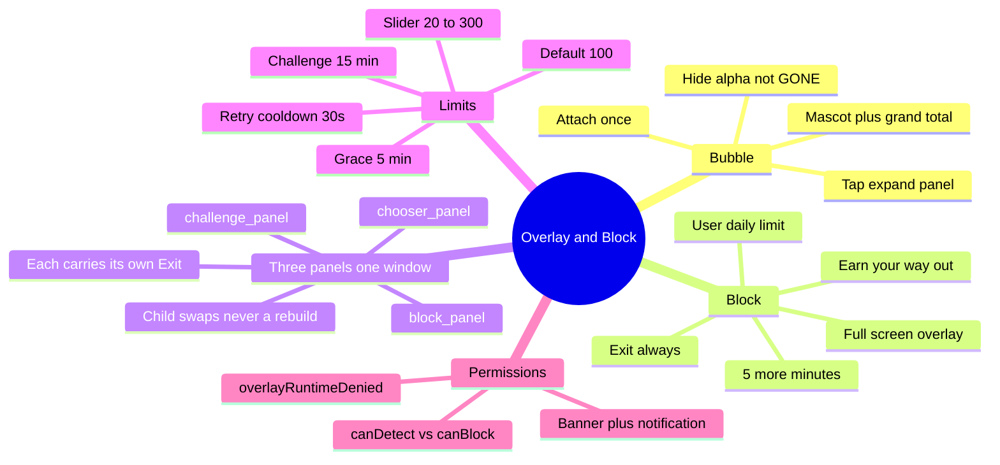

# Overlay and Block

← [[ScrollKiller]]

## Mind map

## Invariant 6
Exit and Back leave from **every** state. **All three panels** carry their own Exit, listed **first**
so TalkBack reaches the way out before any way to keep scrolling. A chooser or challenge screen
offering only "Back" would be a second screen to escape before you can escape — which is exactly
what the invariant forbids.

The root view never goes GONE: that frees the window's surface, and it would also drop the focus the
Back-key listener depends on.

Related: [[Challenges]] · [[Guilt]] · [[Detection]]

#block #overlay
