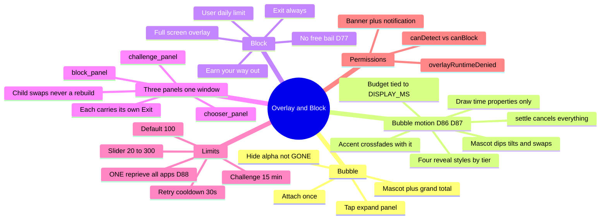

# Overlay and Block

← [[ScrollKiller]]

## Mind map

## Invariant 6
Exit and Back leave from **every** state. **All three panels** carry their own Exit, listed **first**
so TalkBack reaches the way out before any way to keep scrolling. A chooser or challenge screen
offering only "Back" would be a second screen to escape before you can escape — which is exactly
what the invariant forbids.

The root view never goes GONE: that frees the window's surface, and it would also drop the focus the
Back-key listener depends on.

Related: [[Challenges]] · [[Guilt]] · [[Detection]]

#block #overlay

## ⚑ ONE reprieve, not one per app (D88)

Reported from real use: *"I did exercise in Instagram but in YT shorts it is again blocking."*

The daily limit went **global** at D76 — one budget across every blocking app — and the reprieve a
challenge buys stayed keyed by **platform**. So you hit the shared limit in Instagram, walked twenty
steps, got let out of Instagram, opened YouTube, and the block was waiting: the shared count was
still over the shared limit and YouTube's own grace key was zero. **You paid once and were charged
per app.**

Three earlier decisions already said that is wrong — D76 (one budget), D77 (a completed challenge is
the *only* way past a block, so charging twice for one block charges for something that does not
exist), and D83 (escalation is charged across the whole challenge set precisely so the price cannot
be dodged by switching). The reprieve is what the challenge **buys**, so it has to be in the same
currency as what it is spent against.

The fix is a **deleted parameter**: `graceUntilMs(context)` no longer accepts a platform, so the old
bug is unwriteable rather than merely untested.

**Still per-platform, and correctly so:** *gating*. `blocksAtLimit` answers "may we cover **this**
screen", not "has the day's budget run out" — so a SHADOW app still shows the bubble at any count
and any reprieve.

## Motion, and why the bubble is not allowed springs (D86/D87)

The in-app screens move on spring physics. The bubble does **not**, and cannot: a spring has no
bounded duration, and the bubble's motion budget is asserted against `GuiltCadence.DISPLAY_MS` —
animation spends the reading time D83 bought, so it has to be a number a test can check. Only
draw-time properties (alpha, scale, translation, rotation) are ever animated; animating a layout on
a WindowManager window is the surface churn D30 forbids, arriving sixty times a second.

`settle()` matters more here than in an Activity: **nothing recreates this window**, so a view
abandoned mid-animation stays that way until the service dies.
