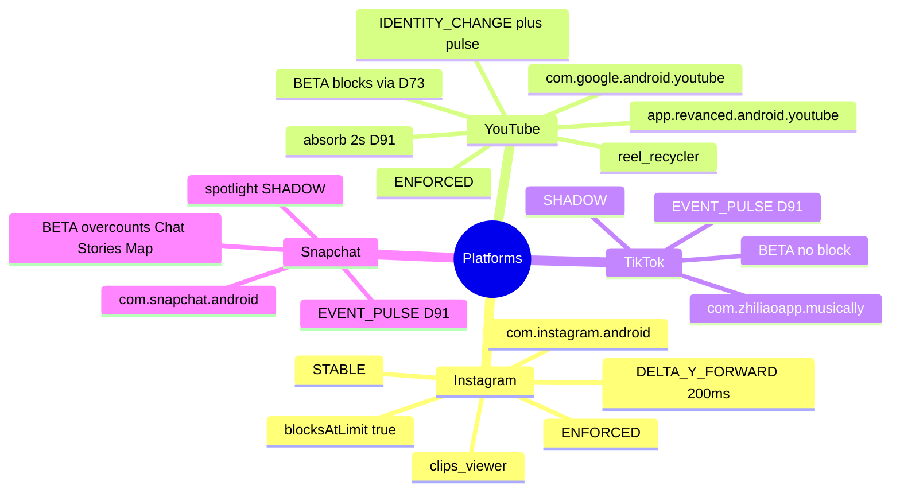

# Platforms

← [[ScrollKiller]]

## Mind map

## Rule
`blocksAtLimit = blockEnabled && (STABLE || blocksWhileUncalibrated)` — IG is STABLE; YT blocks via the D73 override while staying BETA. TikTok/Snapchat stay SHADOW and must not get the override.

Related: [[Detection]] · [[Overlay and Block]]

#platforms
