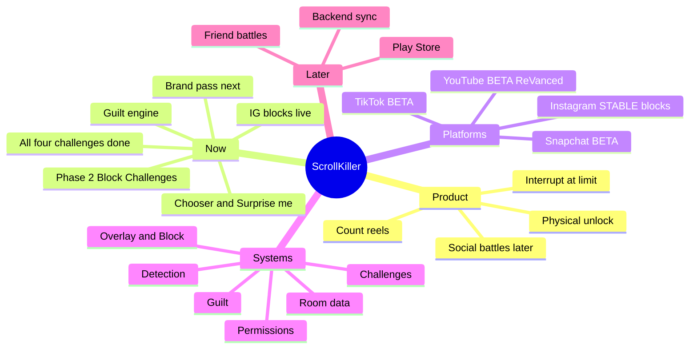

# ScrollKiller

Anti-doomscroll app — detect reels on-device, block at your limit, unlock with a challenge.

> Vault home (replaces Welcome). Open **Outline** or a Mind Map plugin on this note.
> Full audit for Claude/code: `docs/PROJECT_MAP.md` in the repo.

---

## Mind map

---

## Map

### [[ScrollKiller]]
#### Product
- Detect reel scrolling **on-device** (AccessibilityService)
- Block at **user** daily limit (Instagram live)
- Unlock: **"5 more minutes"** (free, 5 min) or a **[[Challenges|challenge]]** you pick — Walk 20 / Jump 10 / Face down 30s / Forehead 30s (15 min, flat)
- Device = truth (Room). Server = scoreboard later
- Competitor: BrainPal

#### Invariants (never break)
1. Sync = deltas + `batch_id` (Phase 3)
2. Day boundary = user timezone (server later)
3. Leaderboard cache 30s
4. Raw events prune >7d
5. Accessibility **disclosure first**
6. **Block always exitable** — P0

#### [[Detection]]
- `ReelScrollAccessibilityService` — events only
- `PlatformSpec` registry
- IG: swipe debounce · YT: identity change
- Surface markers + 3s hysteresis

#### [[Platforms]]
- **IG** — STABLE · ENFORCED · `clips_viewer` · **blocks**
- **YT** — BETA · ENFORCED · `reel_recycler` · + ReVanced package
- **TikTok / Snap** — BETA · SHADOW · no block

#### [[Overlay and Block]]
- Bubble (mascot + total) · expand panel
- Full-screen block · Exit · grace 5m · challenge 15m
- PermissionHealth — never fail silent
- Retry cooldown 30s (D52)

#### [[Guilt]]
- Pack JSON · tiers 50/70/100/150
- Cadence floors at every 5 scrolls from 320
- 7-day no-repeat · `{count}` tokens
- Expand T3→40 · T4→150 (open)

#### [[Challenges]]
- Walk 20 ✅ · Jump 10 ✅
- Face-down / forehead — declared only

#### [[Data]]
- Room: daily_counts · scroll_events · guilt_shown
- Optimistic counts → UI before DB

#### Roadmap
- P1 ✅ Detection MVP
- **P2 ← CURRENT** Block & Challenges
- P3 Backend · P4 Social · P5 Ship

#### Open now
- HANDOFF D52 device runs
- Guilt pack expansion
- YT → STABLE acceptance
- Face-down / forehead challenges

---

## Quick links

| Note | What |
|------|------|
| [[Detection]] | Accessibility + detectors |
| [[Platforms]] | IG / YT / TikTok / Snap |
| [[Overlay and Block]] | Bubble + block screen |
| [[Guilt]] | Lines, cadence, pack |
| [[Challenges]] | Walk / Jump / sensors |
| [[Data]] | Room + repository |

Repo docs (outside vault): `../docs/PROJECT_MAP.md` · `../docs/ROADMAP.md` · `../HANDOFF.md` · `../CLAUDE.md`

#scrollkiller #mindmap
