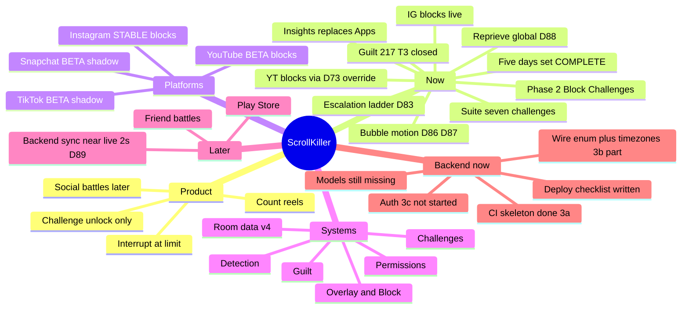

# ScrollKiller

Anti-doomscroll app — detect reels on-device, block at your limit, unlock with a challenge.

> Vault home (replaces Welcome). Open **Outline** or a Mind Map plugin on this note.
> Full audit for Claude/code: `docs/PROJECT_MAP.md` in the repo.
> Last synced: **2026-08-04** (Insights D82 · escalation D83 · suite 7 D84 · guilt **217** D85+D86 ·
> bubble **motion** D86 · premium pass D87 · **reprieve went global D88** · **sync is ~2s** D89).

---

## Mind map

---

## Map

### [[ScrollKiller]]
#### Product
- Detect reel scrolling **on-device** (AccessibilityService)
- Block at **one global** daily limit across every blocking app (D76)
- Unlock: a **[[Challenges|challenge]]** you pick — **strict mode (D77)**, no free "5 more minutes"
- Device = truth (Room). Server = scoreboard later
- Competitor: BrainPal

#### Invariants (never break)
1. Sync = deltas + `batch_id` (Phase 3)
2. Day boundary = user timezone (server later)
3. Leaderboard cache **2s while a friends screen is open, 30s otherwise** (amended D89 — a scroll
   battle at 30s resolution is not a battle). The client still never talks to Redis.
4. Raw events prune >7d (time rolled into `daily_minutes` first — D80)
5. Accessibility **disclosure first**
6. **Block always exitable** — P0

#### [[Detection]]
- `ReelScrollAccessibilityService` — events only
- `PlatformSpec` registry
- IG: swipe debounce · YT: identity change
- Surface markers + 3s hysteresis

#### [[Platforms]]
- **IG** — STABLE · ENFORCED · `clips_viewer` · **blocks**
- **YT** — BETA · ENFORCED · `reel_recycler` · **blocks via D73 override** · + ReVanced package
- **TikTok / Snap** — BETA · SHADOW · no block

#### [[Overlay and Block]]
- Bubble (mascot + total) · expand panel · **motion D86/D87**
- Full-screen block · Exit · challenge 15m (only reprieve) — **ONE reprieve across every app (D88)**
- PermissionHealth — never fail silent
- Retry cooldown 30s (D52)

#### [[Challenges]]
- **Seven** enabled: walk · jump · shake · flip · face down · forehead · balance
- Targets **escalate** per completed reprieve (D83), capped at 4× base
- Flat 15 min reward at every rung

#### [[Guilt]]
- Pack **217** lines; **tier 3 CLOSED**; T4 at **103/150**; premium gating real (D85/D86)
- Display 6.5s → gap derives to 8s (D83)

#### [[Data]]
- Room DB **v4**: `daily_counts` + `daily_minutes` + `scroll_events` + `guilt_shown`
- Insights reads ranges + streaks (D80/D81); screen shipped (D82)

#### UI
- Nav: **Today / Insights / Settings** (Apps deleted, D82) — Insights finally has its OWN glyph (D86)
- Tabs move on **spring physics** (D87); the overlay deliberately does not — see [[Overlay and Block]]
- Launcher mark is real art now, not the scaffold placeholder (D86)
- Welcome → disclosure → overlay → dashboard (D78)

#### Device debt (see HANDOFF)
- Finish Run M (D80) rollup + clear
- Run P escalation ladder
- Run Q new sensors
- Run R (D85) premium voice
- Run O Insights UI
- **Run S** (D86/D87) bubble motion, icon, colour crossfade
- **Run T** (D88) one exercise gets you out of EVERY app — ⚑ highest priority, it is a reported bug
