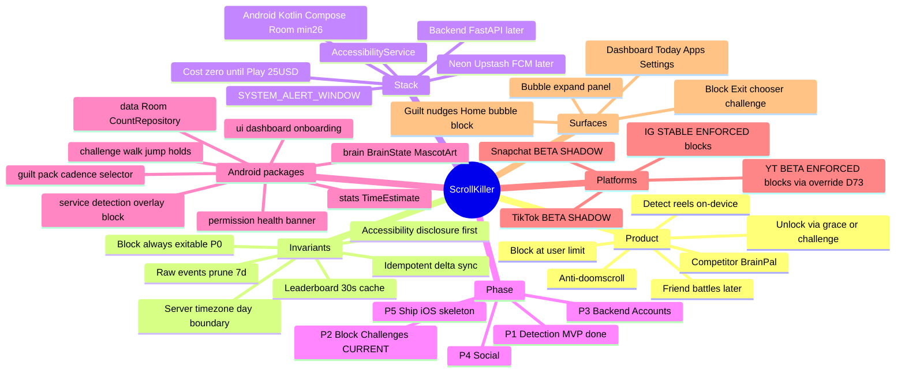

# ScrollKiller — Project Map

> **Single entry point.** Living audit + index of every doc in the project. Pointers only — never a
> dump of ROADMAP/DECISIONS.
> Last audited: **2026-07-28** (Phase 2 · challenge suite COMPLETE 4/4 · brand pass done D58 · **YouTube NOW BLOCKS via the D73 override, reversing D57** · **"5 more minutes" DELETED, D74** · **D70/D71/D73/D74 all in tree with device verification PENDING — invariant 6 is not closed, and D72's attach-timing question is still unanswered**).

## Read order for a new session

**`CLAUDE.md` → this file → the specific doc(s) the current ROADMAP item needs. Nothing else by
default.**

That is the whole rule. Everything below tells you *which* doc a task needs so you open one instead
of loading the set. If you find yourself reading DECISIONS.md end to end or the ROADMAP status log,
stop — scan the ADR index or the current-phase section instead.

---

## Doc index — what each file holds, and when to open it

| Doc | Contains | Open it when |
|-----|----------|--------------|
| [../CLAUDE.md](../CLAUDE.md) | Invariants (the 6 non-negotiables), stack, conventions, session protocol | **Always, first.** It is short and it overrides everything |
| **this file** | Project audit, phase status, package map, per-area summaries | **Always, second.** Orient here before opening anything else |
| [ROADMAP.md](ROADMAP.md) | Phases, checkboxes, and an append-only session log | You need the CURRENT phase's open items. **Read the `← CURRENT` section only** — the status log is long and historical |
| [DECISIONS.md](DECISIONS.md) | ADRs D1…D58, append-only, with a 58-line title index at the top | You need *why* something is the way it is. **Scan the index, then open the one Dn** — never the whole file. D55+ titles are greppable via `^\*\*D` |
| [../HANDOFF.md](../HANDOFF.md) | Manual on-device checklists, newest first | You are writing or running device verification. Only the `← CURRENT` block is live |
| [SCHEMA.md](SCHEMA.md) | Server tables + sync flow | Phase 3+ backend work. Nothing in the app reads this yet |
| [STORE_COPY.md](STORE_COPY.md) | Claims the Play listing may **not** make | Before writing any user-facing marketing copy, or pre-submission |
| [architecture.mermaid](architecture.mermaid) | Whole-system component flowchart | You need the shape of the system rather than one area |

### Obsidian vault — `ScrollKiller/`

Topic notes as mermaid mindmaps, cross-linked with `[[wikilinks]]` for graph view. These are the
**human** navigation layer; this file is the one for code work. Vault home:
[ScrollKiller](../ScrollKiller/ScrollKiller.md), with
[Detection](../ScrollKiller/Detection.md) ·
[Platforms](../ScrollKiller/Platforms.md) ·
[Overlay and Block](../ScrollKiller/Overlay%20and%20Block.md) ·
[Challenges](../ScrollKiller/Challenges.md) ·
[Guilt](../ScrollKiller/Guilt.md) ·
[Data](../ScrollKiller/Data.md).

**Link policy:** `docs/` uses standard markdown links — Obsidian's graph view already includes
relative markdown links, so the graph stays navigable *and* the links stay clickable on GitHub.
`[[Wikilinks]]` are used inside `ScrollKiller/` only. See D56.

---

## Mermaid mindmap



---

## Outline (Obsidian Mind Map source)

### ScrollKiller (working name)
#### Product
- Anti-doomscroll: count reels → interrupt at limit → physical unlock → social later
- Device = source of truth (Room). Server = scoreboard only (Phase 3+)
- No content leaves device — only counts
- Competitor teardown target: BrainPal (`com.brainrot.android`)

#### Non-negotiable invariants → `CLAUDE.md`
1. Sync idempotent — `batch_id` UUID; never POST absolute counts
2. Day boundary = user timezone (server); client interim `LocalDate.now()` until P3
3. Leaderboard reads cached 30s
4. Raw sync/events pruned >7d; daily aggregates forever
5. Accessibility disclosure before enable
6. **Block always exitable** — Exit/Back from every state; never gated on count/timer/network/challenge — **P0**

#### Stack
- **Now:** Kotlin, Compose, AccessibilityService, Room, min SDK 26
- **Later:** FastAPI / Neon / Upstash / FCM; iOS via GHA macOS only
- **Cost:** ₹0 until Play Store ($25); paid only via DECISIONS ADR

#### Roadmap status (audit 2026-07-28)
- **Phase 1 ✅** Detection MVP — IG calibrated 49/50 (D11); ±2/50 exit still open as formal checkbox
- **Phase 2 ← CURRENT** Block live on IG (D49 verified); challenges **all four device-verified** (D50/D53/D54/D55); chooser + "Surprise me" (D53); brand pass (D58); guilt engine; permission integrity (D51); block retry/ReVanced (D52 verified)
- 🔴 **D70/D71 — two block defects found on device, fixed in tree, NOT yet device-verified.** D71 was a
  **P0 against invariant 6**: an untracked full-screen overlay that Exit, Back and leaving the app all
  failed to dismiss, covering the launcher. D70 was the block refusing to draw on a device where the
  permission was granted, via a self-latching persisted flag. Both are code+tests+docs complete; the
  HANDOFF CURRENT block (Runs 1–4, including the forced-failure escape) is the gate
- **Open P2 work**
  - Expand guilt pack T3→40, T4→150 (content; ~18 each now)
  - Challenges: **suite COMPLETE 4/4, all device-verified**; only fake-scroll feed remains, and it is not a sensor challenge
  - **YT BLOCKS as of D73** (reversing D57), but is **still not calibrated** — the 15±2 swipe / 30s idle acceptance runs remain the open item, and they now matter *more*, not less, because an uncalibrated count is covering a screen. Running them is what lets `maturity` go STABLE and the override be deleted.
  - Many overlay/guilt HANDOFF verifications still unchecked
- **Phase 3 ← CURRENT. 3a SHIPPED 2026-07-28**, 3b next. Sub-phases: **3a** ✅ CI + skeleton + security baseline → **3b** models + migrations → **3c** auth → **3d** sync + `/me/today` → **3e** client queue. **3a–3d touch zero `app/` files**, so the shipped offline app cannot regress.
  - **3a's finding was that the repo did not build from a clean checkout** — 24 untracked paths including `Brand.kt` and both hold sources, plus `gradlew` missing its exec bit and no `.gitattributes`. All fixed and verified by building a fresh clone with no `local.properties`.
  - `backend/` exists: FastAPI skeleton, no domain endpoints. **`app/routers/health.py` must never reach the DB** — liveness and readiness are separate modules and a test walks the import graph (D60). 34 tests, 100% coverage floor, all gates blocking, image runs as UID 10001.
  - ⚠️ **The first CI run has not been observed yet** — `android.yml`/`backend.yml` are PR-triggered and no PR is open. D67's fallback ladder for the JBR-vs-Temurin daemon-JVM pin is written but untested.
  - Recorded: **D59** monorepo, **D60** security-first, **D65** reconciliation (`server_acked + local_unacked`, CRDT-shaped), **D66** Redis/FCM→P4, **D67** Temurin/JBR split, **D68** private-now-public-later, **D69** Python 3.13. **D61–D64 deliberately unwritten** — claims about real infra, recorded in the sub-phase that verifies them.
- **Phase 4–5** Social, Play ship — not started

---

### Detection pipeline (`service/`)
#### ReelScrollAccessibilityService
- Event-only — **no God-class**; emits to overlay + repository
- Routes by `PlatformSpec.advanceStrategy`
- Surface: per-event marker match + **3s hysteresis**; hold while `overlay.isBlocking`
- Entry credit on surface enter — **suppressed** for `IDENTITY_CHANGE` (YT)
- DEBUG: `SurfaceDiagnostics`, `YtProbe`, `DIAG_LABEL` broadcast

#### PlatformSpec / PlatformRegistry
| Platform | Packages | Marker | Gating | Advance | Maturity | blocksAtLimit |
|----------|----------|--------|--------|---------|----------|---------------|
| Instagram | `com.instagram.android` | `clips_viewer` | ENFORCED | DELTA_Y_FORWARD 200ms | **STABLE** | **true** |
| YouTube | `com.google.android.youtube`, `app.revanced.android.youtube` | `reel_recycler` | ENFORCED | IDENTITY_CHANGE 500ms | **BETA** (still uncalibrated) | **true via override** (D73) |
| TikTok | `com.zhiliaoapp.musically` | feed_* candidates | SHADOW | DELTA_Y_FORWARD | BETA | false |
| Snapchat | `com.snapchat.android` | `spotlight` | SHADOW | DELTA_Y_FORWARD | BETA | false |

- `blocksAtLimit = blockEnabled && (STABLE || blocksWhileUncalibrated)` — never ask raw `blockEnabled` alone
- ⚠️ **TWO platforms can block: Instagram and YouTube (D73, reversing D57).** YouTube's Shorts capture was never produced across four sessions, and it still has not been — so YT was NOT promoted to STABLE. It blocks via an explicit `blocksWhileUncalibrated` override, keeps `Maturity.BETA`, and keeps its Beta badge, because the count really is unmeasured and the badge is the honest disclosure. **`Maturity.BETA` therefore no longer implies "cannot block"** — it means "the count is not calibrated", which is all it ever measured. The override is the split D32 prescribed; taking it was an owner decision that trades a few Shorts of accuracy for coverage.
- ⚠️ **The override is ILLEGAL on a SHADOW platform, and a test enforces it.** TikTok and Snapchat stay barred, and not by convention: their counts are wrong about *what* they counted (TikTok app-wide, Snapchat counts Chat/Stories/Map as "snaps"), so an override there covers a screen on the wrong basis entirely. What makes YT tolerable is ENFORCED gating on the toured `reel_recycler` — a marker miss undercounts, it never blocks the home feed's Shorts shelf.
- **When the acceptance capture finally lands:** flip `maturity` to STABLE and **delete `blocksWhileUncalibrated` in the same commit** — an override that no longer overrides is an invitation to reuse it somewhere it does not belong.
- `packageNames: List` (D52) — ReVanced shares YT row in `daily_counts`
- Enums: `AdvanceStrategy`, `GatingMode`, `Maturity`, `SurfaceMatcher`

#### Detectors
- `SwipeDetector` — activity-reset quiet gap, forward-only (IG)
- `IdentityAdvanceDetector` + `ReelIdentity` — handle/@ identity on CONTENT_CHANGED (YT)
- `EVENT_PULSE` — declared, unused

---

### Overlay & block (`service/` + `permission/`)
#### OverlayController
- Coordinates bubble + block; one count Flow (`observeTodaySummary`)
- Bubble: attach-once; hide = **alpha 0 + NOT_TOUCHABLE** (never GONE — D30)
- Expand panel in-place (`BubbleView` + `BubbleBreakdown`); placement via `OverlayPlacement` / `OverlayMetrics`

#### BlockScreenController
- Full-screen `TYPE_APPLICATION_OVERLAY` at user limit
- Outcomes: `SHOWN / ALREADY_SHOWING / NO_PERMISSION / FAILED / COOLING_DOWN` (D52). **No permission
  pre-check** — attempt first, classify the failure after (D70)
- ⚠️ **Attach is verified ASYNCHRONOUSLY and `PENDING_ATTACH` is a real outcome.** `isAttachedToWindow`
  cannot be true right after `addView` — `mAttachInfo` is set in `ViewRootImpl.performTraversals()`,
  a frame later. The synchronous check made since D52 read healthy windows as refused; **that is the
  leading suspect for every block failure in this project's history**, including the D71 trap (the
  orphan *was* the block) and the flag D70 found latched. Three observation points:
  `onViewAttachedToWindow`, a next-frame `post`, and a 250ms deadline (`ATTACH_DEADLINE_MS`).
  **HYPOTHESIS UNDER TEST — see HANDOFF Runs A–D before treating it as settled**
- `OverlayDiagnostics` — one greppable state block on a genuine refusal: exception class+message,
  `canDrawOverlays`, AppOps SAW mode (**diagnostic only, never a gate** — D70), `bubbleAttached`
  (the bit that splits "device refuses our overlays" from "device refuses THIS window"), device, params
- `show()` is TOTAL — whole body inside a failure boundary; `render`'s BLOCK branch is wrapped too,
  because a throw in a `Flow.onEach` cancels the collection and kills the count collector
- detach listener; hide reasons logged
- **`attachedRoot` = ownership, recorded when `addView` RETURNS, not when it succeeds (D71).** The
  `!isAttachedToWindow` path used to return with the window still in the WindowManager and nothing
  referencing it — a full-screen opaque overlay no button, no Back and no app-switch could dismiss,
  outranking the launcher. `hide()` is unconditional; `sweepOrphan()` on `offSurface`/destroy
- **Back is `BlockRootView.dispatchKeyEvent`, not an OnKeyListener** — focus-independent (D71)
- Panels live in a `ScrollView fillViewport` so Exit is reachable at any font scale
- Every button / chooser row / Back logs a **pair**: `TAP <n>` then `TAP <n> → <outcome>`
- `BlockFailureInjector` — DEBUG-only, `adb ... -a com.scrollkiller.BLOCK_FAIL --es mode no_attach|throw|off`
- Always: **Exit**, **Back**, challenge path. **"5 more minutes" was DELETED (D74)** — button, string, `GRACE_MINUTES`/`GRACE_MS` and the `onSnooze` handler. The only reprieve is now a completed challenge (15 min). Invariant 6 is unaffected: a snooze was never an exit
- **THREE panels, one window** (D50/D53): `block_panel` / `chooser_panel` / `challenge_panel`; child swaps via one `showPanel` helper so "exactly one visible" cannot be broken piecemeal. Root never GONE (D30). **Each panel carries its own Exit, listed first** for TalkBack traversal — invariant 6

#### BlockLimits
- Default 100; slider 20–300 step 10; challenge grace **15** min — the ONE reprieve since D74
- Retry cooldown 30s (`BlockRetryPolicy`)

#### PermissionHealth (D51/D52, corrected by D70)
- Gaps (worst first): ACCESSIBILITY → OVERLAY → **OVERLAY_BLOCKED_BY_SYSTEM** → NOTIFICATIONS
- `canDetect` vs `canBlock` — silent half-dead is forbidden
- Home banner (guaranteed) + notification (best-effort) + logcat
- `overlayRuntimeDenied` = observed window failure (ROM lies on `canDrawOverlays`)
- ⚠️ **`canBlock` = `accessibilityEnabled && canDrawOverlays` ONLY.** It answers what is *queryable*
  and must never gate on the observed flag: doing so latched blocking off permanently, because the
  flag's only clearing site sat behind the gate it closed (D70). The observation lives in
  **`blockObservedBroken`** — banner/`firstMissing` only, never a gate. **A stale signal may darken
  a banner and may never veto an attempt.** Self-heals when the bubble attaches

---

### Data (`data/`)
#### Room `scrollkiller.db` (v3)
- `daily_counts` — (date, platform) PK, atomic UPSERT +1
- `scroll_events` — raw log, prune >7d
- `guilt_shown` — lineId + lastShownMs (7-day no-repeat)

#### CountRepository
- Offline-first source of truth
- Optimistic `PendingCounts` + `TodayMerge` (max) — UI updates before Room round-trip (D39)
- All reads from `observeTodaySummary()` — one collector, no drift
- DEBUG `CountLatency` DETECT→…→RENDERED

#### SettingsPrefs
- Bubble toggle, overlay skip, daily limits, grace deadlines, guilt locale, warning-once/day, motion permission, etc.

---

### Guilt (`guilt/` + `assets/guilt_pack.json`)
#### Model
- Pack: remote-shaped JSON; categories roast / existential / reverse_psych / **pride**
- ~72 lines, ~18/tier; India Gen-Z; `{count}` / `{minutes}` tokens only (D47)
- **Expansion targets:** T1/T2=18 ✅ · T3=40 · T4=150 (shipped short on T3/T4)

#### Axes (tunable apart)
- **Intensity** `GuiltTier` — silence <50; then 50/70/100/150 → MILD…EXTREME
- **Cadence** `GuiltCadence` — 100→/10, 250→/7, **320→/5 forever** (D48 floor)
- **When** `GuiltFiring` — baseline, pending gap, `MIN_GAP_MS=5.5s`
- **What** `GuiltSelector` / `GuiltRotation` / `GuiltHistory` (7d exclusion)

#### Surfaces
- Bubble nudge (fire), Home/panel (`current()` pin), block (own draw, no reverse_psych)
- No hardcoded `GuiltLine(` outside pack parser — build-enforced

*BrainState (50/150 mascot) ≠ GuiltThresholds (what we say) — keep separate.*

---

### Challenges (`challenge/`)
| Spec | Type | Target | Sensor | Status |
|------|------|--------|--------|--------|
| `walk_20` | WALK | 20 steps | STEP_EVENTS → STEP_CUMULATIVE fallback | **enabled** (D50 ✅ device) |
| `jump_10` | JUMP | 10 jumps | ACCEL_PEAKS | **enabled** (D53 ✅ device) |
| `face_down_30` | FACE_DOWN | 30 s hold | ORIENTATION_HOLD | **enabled** (D54 ✅ device) |
| `forehead_30` | FOREHEAD | 30 s hold | PROXIMITY_HOLD | **enabled** (D55 ✅ device) |
| — | fake-scroll feed | — | not a sensor challenge | not started |

**Suite is 4/4.** `IMPLEMENTED` now equals the full declared `SensorStrategy` set — a legitimate
state, not a bug; the test says so and names what to do when the next strategy is declared early.

- **`ChallengeRegistry.IMPLEMENTED` is the gate** — a spec naming an unimplemented strategy fails the build (`ChallengeRegistryTest`), so a challenge can never ship unable to complete
- Engine shape: `ChallengeSpec` (data) → `ChallengeSensors.sourceFor` → `ChallengeSensorSource` impl; pure detector beside each thin source (`JumpDetector`, `HoldDetector`)
- **Counts vs holds** — `ProgressUnit {COUNT, SECONDS}`. Counts are monotonic; a hold's `onHoldElapsed` is absolute and **resets to 0 on a break** (never pauses — the anti-cheat), so `isComplete` is NOT sticky for holds. Ring counts down for seconds, arc always fills
- **Holds need two things counts didn't** (D54): `FLAG_KEEP_SCREEN_ON` while the challenge panel is up (a 30s default screen timeout == the hold length, and a sleeping screen stops the sensor), cleared on every teardown path; and `ChallengeHaptics` — 400ms buzz complete / two-pulse break — because a face-down ring is invisible and flipping up to check destroys the hold
- Reward **flat 15 min** for every challenge, and since D74 it is **the only reprieve in the app** (the 5-min free tap it used to be measured against is deleted, and D50's asserted inequality with it). Flat was chosen over effort-scaled so choice stays about accessibility, not optimisation (D53)
- **Availability is per-spec** (`ChallengeAvailability`), not app-wide: only the step sensors need `ACTIVITY_RECOGNITION`, so a denied motion permission must not hide jump/holds. `MotionStatus` remains the step-specific question for Settings + PermissionHealthReader
- Chooser panel + "Surprise me" (never repeats the previous draw); unavailable → no row

---

### Brand (`ui/theme/`) — D58
- **`Brand.kt` is the ONE place a brand colour is written.** Plain Kotlin `0xAARRGGBB` Longs, no Compose/Android imports, because the bubble + block + ring are plain views over other apps and can NEVER read `MaterialTheme`. Compose does `Color(Brand.X)`; views do `Brand.X.toInt()`
- Palette **sampled from the mascot art**: cobalt `#0050B0` (cap) leads — calm ground, coral `#F08090` (brain) accents. Coral is `secondary`, never `primary`
- **No `dynamicColor`** — the parameter is deleted, not defaulted false. It used to derive the palette from the user's wallpaper
- **XML layouts carry zero brand colours** — applied in code at inflation (`BlockScreenController.styleFromBrand`). Sole exception: `themes.xml` windowBackground, mirrored in `colors.xml` with cross-comments
- Button hierarchy is an **invariant-6** decision: Exit = highest contrast on every panel, snooze = quietest
- Type: full `displayLarge`→`labelSmall` scale, negative tracking on display sizes. Still Roboto (licensing a display face is a product call; swap is one `FontFamily` edit)
- Nav bar: `mascot_head` (crop MEASURED at 24dp, aspect 1.03) + two hand-written vectors. Head is `Image` (untinted art); vectors are `Icon` (tint with selection)

---

### Brain & art (`brain/` + `art/mascot/` + `tools/mascot_import.py`)
- `BrainState`: HEALTHY / CRACKING / FRIED @ 50 / 150
- `MascotArt`: + GUARDIAN (block-only, not a BrainState)
- Pre-scaled hero 120dp / bubble ~40dp height; geodesic flood key + union trim

---

### UI (`ui/`)
#### Onboarding
- Disclosure → Accessibility Settings → optional Overlay permission
- `onResume` re-check; skip overlay persisted

#### Dashboard (Compose Material3)
- Tabs: **Today** (mascot + total + time + guilt + permission banner) / **Apps** / **Settings**
- Settings: perms, bubble, limit slider(s) for `blocksAtLimit` platforms, clear data, motion, notifications, pack picker

---

### Backend (not in tree yet) → SCHEMA.md
- Auth Google → JWT; POST `/sync` deltas; GET `/me/today`
- Postgres: users, sessions, devices, daily_counts, friendships, sync_batches
- Redis ZSET leaderboards; FCM taunts — Phase 4

---

### Store / Play posture → STORE_COPY.md
- ❌ Never claim block unbypassable / always works
- Honest pitch: friction, choice, number in your face
- Accessibility disclosure required

---

### Test surface (`app/src/test`)
Pure JVM coverage for: detectors, registry, BlockPolicy/Limits/Retry, PermissionHealth, guilt*, BubbleBreakdown, OverlayPlacement, TodayMerge, Challenge*, TimeEstimate, BrainState, SurfaceMatcher, ReelIdentity…

---

### Current HANDOFF focus (see HANDOFF.md)
**Attach-timing diagnostic (CURRENT, an experiment not a fix):** does `attachedSync=false` become
`ATTACH LANDED` / `PROBE next-frame attached=true` one frame later? If yes, the ROM never refused
anything and D52's premature check is the root cause of the whole saga. If no, the
`DIAG stage=no-attach-by-deadline` line is the payload. Run B (**block over a NON-Instagram app**)
splits ROM-refusal from Instagram's `setHideOverlayWindows`. Still owed: the `:415` stack trace.
**Not built on purpose:** the `performGlobalAction` fallback and the retry ladder — they reverse D49
and wait on this evidence.

**D73/D74 — YouTube blocks, the reprieve is gone (CURRENT, unverified):** Runs E–G in HANDOFF. The
YT limit slider must APPEAR in Settings · Shorts blocks and **the feed does not** (the Shorts-shelf
false-match is the thing to watch) · the **Beta badge must survive** · ReVanced too · the block panel
has exactly two buttons · a completed challenge is now the only reprieve, so if it broke the feature
is dead. **Record the count YT actually fires at** — that is the D57 calibration data, four sessions
owed.

**D70/D71 — the block screen (CURRENT, blocking):** block draws with the permission granted and the
stale flag self-clears · `BLOCK PREVENTED` must NOT appear · **every way out works and logs a pair** —
Exit, chooser, hardware BACK from all three panels · forced-failure
(`--es mode no_attach`) leaves **no window on screen and no stacking** · Exit reachable at max font
size. Invariant 6 stays open until all four runs pass.

**D58 — brand pass (CURRENT):** no purple, palette must NOT move when the wallpaper changes · light+dark sweep · hero card tint shifts at 50/150 · mascot head in FULL COLOUR in the nav bar · **Exit still the most prominent button on all three panels** · no new bubble churn.
**D55 — forehead hold:** chooser is 4 deep + Surprise me · ring counts down, resets on break · **thumb-on-a-table must NOT count** (needs upright too) · **OEM pocket mode** — report if covering proximity locks your screen · neither proximity nor accel left registered · absent row on a device with no proximity sensor.
**D54 — face-down (✅ verified) · D53 — jump + chooser (✅ verified).**
Also still owed: D51 permission integrity device runs; older overlay/guilt acceptance runs; the **17s stall** answer was never recorded either way.

---

## Package → responsibility (quick index)

```
com.scrollkiller
├── MainActivity / ScrollKillerApp
├── service/     detection, platforms, overlay, block, placement, probes
├── data/        Room, CountRepository, SettingsPrefs, latency
├── guilt/       pack, tiers, cadence, firing, selector, history
├── challenge/   specs, sensors, controller, ring UI
├── permission/  PermissionHealth, notifier
├── brain/       BrainState, MascotArt
├── ui/          dashboard, onboarding, theme
└── stats/       TimeEstimate
```

---

## Audit checklist (maintain this map)

When a session ends, update **only** these bullets if they changed:

- [ ] Phase / CURRENT label
- [ ] Platform table (maturity, gating, blockEnabled, packages)
- [ ] Challenge registry enabled list
- [ ] Guilt pack sizes / expansion targets
- [ ] Latest ADR number + HANDOFF headline
- [ ] Open P2 checkboxes
- [ ] The `ScrollKiller/` vault notes, when a fact in one of them changes (they drift silently —
      `Challenges.md` was found two challenges behind)
- [ ] **Fence balance** — every doc's `grep -c '^```'` must be EVEN before you finish (D56)

*Do not paste full ROADMAP status-log entries here — link them.*