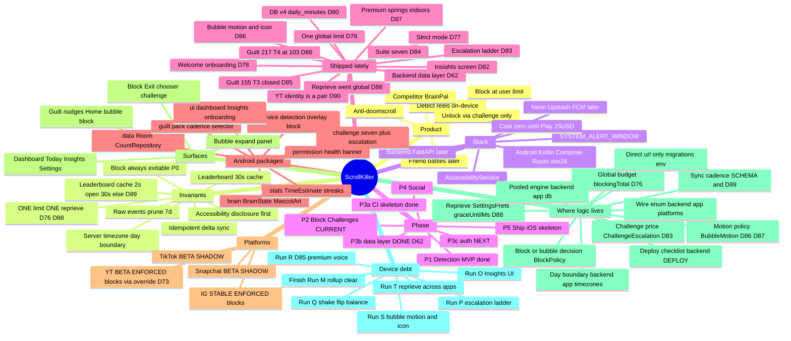

# ScrollKiller — Project Map

> **Single entry point.** Living audit + index of every doc in the project. Pointers only — never a
> dump of ROADMAP/DECISIONS.
> Last audited: **2026-08-10** — **Phase 3b DONE (D62); Phase 3c (auth) is next.** Android state
> unchanged from the 2026-08-04 audit below (Phase 2 · challenge suite **7/7 — D84**, 4 device-verified + 3 not · brand pass done D58 · **YT blocks via D73 override** · **ONE global daily limit (D76)** · **STRICT MODE — no free "5 more minutes" (D77)** · **✅ BLOCK SAGA CLOSED (D72)** · **Pass A (D78) + Pass B1 data (D80/D81) + Pass B2 Insights screen (D82) all SHIPPED** — nav is **Today / Insights / Settings**, Apps tab deleted · five-days set **COMPLETE — 1/2/3/4 shipped (D83/D84/D85/D86)** · bubble MOTION + real launcher mark + Insights glyph (D86) · guilt pack **217, T4 103/150** · **✅ 459 tests / 44 suites GREEN, run 2026-08-11 on the dev machine — `BubbleMotionTest` DID execute.** The long-standing "no SDK, D86 never run" caveat is retired: the SDK *is* on this machine, and the build needs `JAVA_HOME` pointed at **Temurin 21** — the Android Studio JBR is Java 25 now and the Gradle daemon rejects it.)
>
> **Device session 2026-08-03 (upgrade path on A015):** built OLD APK from `03cebae` (DB v3, no
> welcome) in a worktree + NEW from current tree; unit suite green before install. **Run M (D80)
> upgrade — PARTIAL PASS on one launch:** `user_version` 3→4 with no migration crash · opened on
> **dashboard** (not welcome — real D78 upgrade case) · today's counts survived (**IG 50 + YT 10 =
> 60**) · `.tables` lists **`daily_minutes`**. ⚑ Still owed in that run: a post-scroll
> `SELECT * FROM daily_minutes` (seconds ≈ 6s/reel, not wall-clock) and Clear-all-data emptying it.
> **Run P (D83) ladder — NOT yet exercised on hardware** (chooser rungs / cap / invariant 6 at the
> top / judgement call on walk-80·holds-120s). HANDOFF empty-state line retargeted Apps → Insights.
>
> **2026-08-04 — PIECE 3 SHIPPED (D86), and the five-days-of-real-use set is COMPLETE (1/2/3/4).**
> The bubble now MOVES: pure `BubbleMotion` policy + thin `BubbleAnimator`, four reveal styles picked
> by tier-and-line (never at random), a mascot swap exchanged at the trough of its own dip, a panel
> whose CONTENTS animate inside an already-final box, and a tap acknowledgement. **The motion budget
> is tied to `DISPLAY_MS` by a test** — D83 bought reading time and animation spends it, so a
> cinematic constant now fails the build. **Only draw-time properties may be animated** (D30 at 60 Hz
> is the failure mode), and `settle()` exists because a leaked animator on an overlay window is
> permanent. Also: the **launcher icon was still the scaffold placeholder** in a purple absent from
> the palette (fixed, plus a `<monochrome>` layer and a one-digit `Brand.INK` correction), and the
> **Insights tab was wearing the deleted Apps tab's handset glyph** (now bars). Tabs slide in the
> direction you moved. Pack **155 → 217**, all tier 4 — free **48 → 103** of the 150 target, still
> honestly short. New `BubbleMotionTest`. **D87 followed with the premium pass:** springs on the in-app tabs (Material 3 Expressive; deliberately NOT on the overlay, where a spring's unbounded settle cannot satisfy the budget test), the mascot now TILTS through its swap, and ⚑ **the pill's accent no longer SNAPS while the mascot animates** — a hole D86 left, and the kind that only appears once you have started animating. ⚑ **Device debt gains Run S**, and it is where "cheap" gets
> proven: jank on a mid-range phone inside a real doomscroll is the honest risk and no test sees it.
>
> **Off-device pre-flight 2026-08-04.** Phase 0's desk half is done: escalation re-derived for the
> **seven**-row suite (Run P's checklist was still expecting four rows — fixed, with a full
> expectation table now in HANDOFF), every guilt-pack figure below verified against the JSON
> (155 · free 24/24/40/48 · with premium 26/26/45/58 · no dup ids · no bare integers · longest 83 ch),
> chooser order confirmed against its test, `.gitignore` closed over the two editor-noise files.
> ⚑ **New open judgement call:** D84 took the suite 4→7, which makes a full rotation cost **4**
> charged uses where D83's worked example assumed 2 — rotation now escalates roughly twice as fast
> as that ADR's prose describes. Not a defect (cap holds, leaning still costs most), but Run P must
> now answer it deliberately; the lever is **`GLOBAL_DIVISOR`**, not `CAP_MULTIPLE`. The holds are
> unaffected — `DOUBLE` at `CAP_MULTIPLE = 4` has only three rungs by construction. The unit suite
> was **not** run off-device (no SDK), so 407/41 remains the last known state.
>
> **2026-08-10 — PHASE 3b IS DONE (D62), and Phase 3 is now half built.** The blocker that stopped
> it on 2026-08-04 was environmental — PyPI was reachable this time, so the lockfile regenerated and
> the ORM half landed: all six `SCHEMA.md` tables, the `platform` Postgres ENUM built from the wire
> contract, `app/db.py` on the **pooled** URL, Alembic revision `0001` on the **direct** URL, and a
> `/readyz` that issues a real `SELECT 1`. **The pooling settings were read out of the installed
> dialect source, not recalled** — `NullPool` is a *warning* in SQLAlchemy's own pgbouncer guidance,
> because **pgbouncer IS the pool**. `migrations/env.py` REFUSES to run without `DATABASE_URL_DIRECT`
> rather than falling back, since Alembic's version lock is connection-scoped and a transaction
> pooler does not preserve it. **`docs/SCHEMA.md` is now parsed by a test** and compared to the
> models in both directions. ⚑ Two silent traps found by running it: Alembic re-applies the naming
> convention to names you pass it (`op.f()` everywhere now), and **the backend suite could not run on
> this project's own Windows dev machine at all** — `zoneinfo` needs a system tz database Windows
> does not have, and nobody had ever run the backend gates outside Linux CI. **167 backend tests, all
> four gates green, 100% coverage.** Zero Android files touched. **Next: 3c (auth).**
>
> **2026-08-11 — ⚑ YOUTUBE UNDERCOUNT FIXED (D90), reported from real use.** The per-Short identity
> was the **channel handle alone**, so two Shorts in a row by one creator compared equal and the
> second never counted; inside a creator's own Shorts tab an entire session counted **1**. D34's
> capture had recorded the title alongside the handle — the extraction was discarding it whenever a
> handle existed, which is nearly always. Identity is now a **pair** (`ItemIdentity`), compared
> field-wise with **absent ≠ different** (a naive concat would double-count every Short, since
> YouTube renders handle and title a frame apart). The acceptance tests never caught it because
> `15 swipes count 15` uses fifteen *different* handles and the idle test is indistinguishable from
> the bug. **7 new tests; 452 / 44 green.** ⚑ Title ids are still device-unverified, so confirm with
> `YtProbe`'s `identity=handle=… title=…` line; YT stays BETA. **Snapchat Spotlight is NOT this bug**
> — it is the deliberate SHADOW state and is blocked on a device tour, not on code.
>
> **Five-days-of-real-use set.** Piece 1 **D83** shipped (guilt display 6.5s; escalation +10 / ×2 /
> cap 4× / half-charge on others). Piece 2 **D84** shipped (suite 4→7). Piece 4 **D85** shipped
> (guilt **72→155**, **T3 CLOSED**, premium gating real). ⚑ **Device debt:** finish Run M rollup +
> clear · **Run P** escalation ladder · **Run Q** (shake/flip/balance on hardware) · **Run R (D85)**
> premium gating voice · **Run O** Insights UI · **Run S (D86)** bubble motion + icon.
> **Nothing left to build in the five-days set — Piece 3 was the last of it.**

## Read order for a new session

**`CLAUDE.md` → this file → the specific doc(s) the current ROADMAP item needs. Nothing else by
default.**

That is the whole rule. Everything below tells you *which* doc a task needs so you open one instead
of loading the set.

**Budget.** These two files (~4 KB + ~20 KB) should be enough to orient completely: what phase we
are in, what is open, where every area's code and reasoning lives. If you cannot start work after
reading them, that is a defect in *this file* — fix it here rather than opening more docs.

**Never load by default** — each of these is a large file that a task almost never needs whole:

| Don't | Instead |
|---|---|
| `DECISIONS.md` end to end (~248 KB, 84 ADRs) | The topic table below → read the 2–3 named `Dn` |
| `ROADMAP.md`'s status log (historical, append-only) | The `← CURRENT` phase section only |
| `HANDOFF.md` end to end (superseded runs are kept) | The `← CURRENT` block only |
| Re-reading an ADR you already know is settled | Trust this file's one-line summary unless the task *changes* that area |

**Before finishing any doc edit,** run the fence-balance check — an unclosed code fence does not
fail a build, it silently swallows the rest of the vault's render (D56). Beware bare mid-line
triple-backticks in prose too: they open an inline code span that eats everything up to the next
backtick run. Every count must be **EVEN**:

```
for f in CLAUDE.md HANDOFF.md docs/*.md ScrollKiller/*.md; do echo "$(grep -c '^```' "$f") $f"; done
```

---

## Doc index — what each file holds, and when to open it

| Doc | Contains | Open it when |
|-----|----------|--------------|
| [../CLAUDE.md](../CLAUDE.md) | Invariants (the 6 non-negotiables), stack, conventions, session protocol | **Always, first.** It is short and it overrides everything |
| **this file** | Project audit, phase status, package map, per-area summaries | **Always, second.** Orient here before opening anything else |
| [ROADMAP.md](ROADMAP.md) | Phases, checkboxes, and an append-only session log | You need the CURRENT phase's open items. **Read the `← CURRENT` section only** — the status log is long and historical |
| [DECISIONS.md](DECISIONS.md) | ADRs **D1…D89** (~270 KB), append-only, with a title index at the top. **D61, D63 and D64 remain reserved-and-unwritten**; D62 was written on 2026-08-10 once 3b could verify its claims against the real dialect instead of guessing | You need *why* something is the way it is. **Never open this file whole — it is the single biggest token sink in the repo.** Use the topic table below to get candidate `Dn`s, then read only those. D55+ titles are greppable via `^\*\*D` |
| [../HANDOFF.md](../HANDOFF.md) | Manual on-device checklists, newest first | You are writing or running device verification. Only the `← CURRENT` block is live |
| [SCHEMA.md](SCHEMA.md) | Server tables + sync flow (**near-live ~2s since D89**) | Phase 3+ backend work. ⚑ **Its table block is EXECUTABLE since D62** — `backend/tests/test_schema_parity.py` compares it to `app/models/` both ways, so adding a column means editing this file in the same commit |
| [../backend/DEPLOY.md](../backend/DEPLOY.md) | Hosting choices, the two Neon URLs, spin-down behaviour, first-deploy order, blockers | Before touching deployment, and before anyone wonders why there are two database URLs |
| [STORE_COPY.md](STORE_COPY.md) | Claims the Play listing may **not** make | Before writing any user-facing marketing copy, or pre-submission |
| [architecture.mermaid](architecture.mermaid) | Whole-system component flowchart | You need the shape of the system rather than one area |

### Obsidian vault — `ScrollKiller/`

Topic notes as mermaid mindmaps, cross-linked with `[[wikilinks]]` for graph view. These are the
**human** navigation layer; this file is the one for code work. Vault home:
[ScrollKiller](../ScrollKiller/ScrollKiller.md), with
[Detection](../ScrollKiller/Detection.md) ·
[Platforms](../ScrollKiller/Platforms.md) ·
[Overlay and Block](../ScrollKiller/Overlay%20and%20Block.md) ·
[Challenges](../ScrollKiller/Challenges.md) ·
[Guilt](../ScrollKiller/Guilt.md) ·
[Data](../ScrollKiller/Data.md).

**Link policy:** `docs/` uses standard markdown links — Obsidian's graph view already includes
relative markdown links, so the graph stays navigable *and* the links stay clickable on GitHub.
`[[Wikilinks]]` are used inside `ScrollKiller/` only. See D56, re-affirmed 2026-07-29: switching
`docs/` to wikilinks was considered and rejected again, because it would render every
cross-reference as dead literal text for a PR reviewer on GitHub while buying no graph edge that
the markdown links do not already provide.

---

## Find the ADR without opening DECISIONS.md

**This table is the point of this file.** `DECISIONS.md` is ~248 KB across 84 ADRs; loading it to
answer one "why" question is the most expensive mistake available in this repo. Look the topic up
here, then read **only** the two or three `Dn` it names. Bold = the current, load-bearing decision
for that area; the others are the history that led to it and are usually *not* worth re-reading.

| Topic | ADRs | Current position in one line |
|---|---|---|
| Detection / advance signal | D11, D15, D34, **D90** | IG = `DELTA_Y_FORWARD` (calibrated 49/50); YT = `IDENTITY_CHANGE` on **handle AND title as a pair** — ⚑ **D90 fixed a real undercount: the identity used to be the channel alone, so consecutive Shorts by one creator were invisible and a session inside one channel counted 1.** Absent field ≠ different field, or a late-rendering title double-counts every Short |
| Surface gating (Reels vs feed) | D24, D26, D27, D28 | `GatingMode`; IG `clips_viewer`, YT `reel_recycler`, both **ENFORCED** |
| Platform maturity / eligibility | D32, D57, **D73** | `Maturity` BETA never blocks — *except* YT via the explicit `blocksWhileUncalibrated` override |
| Daily limit | D19, D49, **D76**, D88 | ONE global limit across every blocking app. *What* counts is global (`BlockPolicy.blockingTotal`); *where* it may draw stays per-platform. ⚑ **D88 moved the REPRIEVE global to match** — budget and the thing you spend to escape it must share a currency |
| Overlay window / no-churn | D17, D29, **D30** | Attach once; hide = alpha 0 + `NOT_TOUCHABLE`, **never** root `GONE` |
| Bubble content + panel | D35, D37, D86, **D87** | Compact = mascot + grand total; tap expands bars in place, same window. D86 adds MOTION — draw-time properties only, budget tested against `DISPLAY_MS`, `settle()` mandatory. **D87: the accent CROSSFADES with the mascot (it used to snap) and the mascot tilts through the swap** |
| Block window lifecycle | D49, D51, D52, D70, D71, **D72** | ⚑ **Read D72 first** — the premature attach check was the whole root cause; D52/D70's ROM attribution is withdrawn |
| Block escapes / reprieves | D49, D50, D74, D75, D77, **D88** | **STRICT MODE**: Exit + Back always, and ONE earned reprieve (15 min challenge). No free bail. Sensorless device = Exit alone, pinned by `BlockEscapeTest`. **D88: the reprieve is GLOBAL like the limit** — it was per-platform, so an exercise done in IG did not get you out of YT |
| Challenges | D50, D53, D54, D55, D83, **D84** | Suite is **7/7** (4 device-verified, 3 not); user picks, flat 15-min reward at every rung. Targets **ESCALATE** per completed reprieve, capped at 4× base, reset daily. D84 also records three REJECTED candidates and why |
| Guilt content | D9, D33, D47, D48, **D85** | `assets/guilt_pack.json`, remote-shaped, weighted no-repeat rotation. **217 lines; T3 CLOSED, T4 open at 103/150.** Premium gated on `access`, free pool has no fallback into paid |
| Guilt timing | D46, D48, **D83** | Display 6.5s → gap **8s DERIVED** (never write the gap as a literal). Schedule is in scrolls, gap is in seconds — two units, two files |
| Mascot / brand | D36, D58, **D37** | One `MascotArt` mapping; art is **height**-bounded and not square |
| Onboarding / permissions | D13, D16, D51, D70, **D78** | **Welcome → disclosure → overlay → dashboard.** Value before the ask; the welcome requests nothing so invariant 5 holds. Route is a tested pure function (`OnboardingRoute`) |
| Visual identity / UI polish | D58, D78, D86, **D87** | Palette sampled from the mascot, one source for both render paths. D78 adds the quiet neutral tier (`ON_LIGHT_MUTED`/`ON_LIGHT_FAINT`) for dividers, gridlines and empty states |
| Data model / retention | D4, D14, **D65**, **D80** | Aggregates forever, raw pruned 7d; displayed = server-acked + local unacked. Time is rolled up daily into `daily_minutes` BEFORE the prune — compute while the evidence exists, keep only the answer |
| Stats / streaks | **D81**, D80 | ⚑ Streaks are **provisional** on D14's interim day boundary and can shift in Phase 3 — derive them, never cache them as achievements |
| Backend / CI / infra | D6, D59, **D60**, D66, D67, D68, D69, D79, D89 | Monorepo, path-filtered CI; security baseline before endpoint 1; Redis/FCM are Phase 4. Daemon JVM pinned by VERSION only — a bare vendor pin cannot start on CI, and foojay does not cover the daemon path. **D89: sync is ~2s near-live, not 60s batched, and `backend/DEPLOY.md` is the deploy checklist** |
| Backend data layer / migrations | **D62**, D60, D66 | Two URLs that are NOT interchangeable: app on **pooled** (`NullPool` + both prepared-statement caches off — pgbouncer IS the pool), Alembic on **direct** and it REFUSES to fall back. Platform ENUM stores wire values via `values_callable`. `docs/SCHEMA.md` is parsed by a test, both directions |
| Docs & vault conventions | **D56** | Index-first; markdown links in `docs/`, wikilinks in the vault |

*(D61–D64 are reserved placeholders, deliberately unwritten — see D60's closing note.)*

**Index is complete through D89**, with **D61, D63 and D64 still deliberately unwritten** (cold
starts, refresh-token rotation, server-side day boundary — each gets written by the sub-phase that
verifies it, per D60's closing note). **D62 is now written**, because 3b measured pgbouncer's
behaviour against the installed dialect rather than recalling it.

---

## Mermaid mindmap



---

## Outline (Obsidian Mind Map source)

### ScrollKiller (working name)
#### Product
- Anti-doomscroll: count reels → interrupt at limit → physical unlock → social later
- Device = source of truth (Room). Server = scoreboard only (Phase 3+)
- No content leaves device — only counts
- Competitor teardown target: BrainPal (`com.brainrot.android`)

#### Non-negotiable invariants → `CLAUDE.md`
1. Sync idempotent — `batch_id` UUID; never POST absolute counts
2. Day boundary = user timezone (server); client interim `LocalDate.now()` until P3
3. Leaderboard reads cached **2s while a friends screen is open, 30s otherwise** (D89 amends this)
4. Raw sync/events pruned >7d; daily aggregates forever
5. Accessibility disclosure before enable
6. **Block always exitable** — Exit/Back from every state; never gated on count/timer/network/challenge — **P0**

#### Stack
- **Now:** Kotlin, Compose, AccessibilityService, Room, min SDK 26
- **Later:** FastAPI / Neon / Upstash / FCM; iOS via GHA macOS only
- **Cost:** ₹0 until Play Store ($25); paid only via DECISIONS ADR

#### Roadmap status (audit 2026-08-03)
- **Phase 1 ✅** Detection MVP — IG calibrated 49/50 (D11); ±2/50 exit still open as formal checkbox
- **Phase 2 ← CURRENT** Block live on IG (D49 ✅); suite **7/7** (D84 — 4 device-verified, 3 not); chooser + "Surprise me"; brand pass (D58); strict mode (D77); one global limit (D76); welcome onboarding (D78); Insights data+screen (D80–D82); escalation (D83); guilt **155 / T3 closed** (D85)
- ✅ **D70/D71/D72 — the block saga is CLOSED and device-verified.** Premature `isAttachedToWindow` was the whole root cause; D52/D70's ROM attribution withdrawn. Invariant 6 demonstrated live.
- **Open P2 work**
  - ~~**Piece 3** — UI/tab refresh + bubble animation~~ **DONE (D86).** Kept cheap: draw-time properties only, motion budget tested against `DISPLAY_MS`, no new palette. ⚑ Run S owed
  - Challenges: `shake_30` / `flip_10` / `balance_20` still need **Run Q** on hardware. Fake-scroll feed not started
  - **YT BLOCKS (D73)** but **still not calibrated** — 15±2 swipe / 30s idle runs remain; they matter more now because an uncalibrated count covers a screen
  - Device debt from this afternoon: finish **Run M (D80)** rollup+clear · **Run P** ladder · **Run Q** · **Run R (D85)** · **Run O** Insights UI · older E/F/I/J as capacity allows
- **Phase 3** — **3a ✅ SHIPPED · 3b ✅ SHIPPED (2026-08-10, D62)**: wire enum + day boundary (the earlier stdlib half), then models, the platform ENUM, `app/db.py`, Alembic `0001` and a real `/readyz`. 167 backend tests, four gates green, 100% coverage. Sub-phases: **3a** ✅ → **3b** ✅ → **3c** auth ← **NEXT** → **3d** sync + `/me/today` → **3e** client queue. **3a–3d touch zero `app/src/` files**, which is what keeps the shipped offline app unable to regress while the backend is built.
  - `backend/` FastAPI skeleton; health never hits DB (D60). Daemon JVM pin is **version-only** (D79 correcting D67). Local note: AS JBR is now Java 25 — install **Temurin 21** for Gradle sync (daemon wants 21; no `toolchainUrl` entries).
- **Phase 4–5** Social, Play ship — not started

---

### Detection pipeline (`service/`)
#### ReelScrollAccessibilityService
- Event-only — **no God-class**; emits to overlay + repository
- Routes by `PlatformSpec.advanceStrategy`
- Surface: per-event marker match + **3s hysteresis**; hold while `overlay.isBlocking`
- Entry credit on surface enter — **suppressed** for `IDENTITY_CHANGE` (YT)
- DEBUG: `SurfaceDiagnostics`, `YtProbe`, `DIAG_LABEL` broadcast

#### PlatformSpec / PlatformRegistry
| Platform | Packages | Marker | Gating | Advance | Maturity | blocksAtLimit |
|----------|----------|--------|--------|---------|----------|---------------|
| Instagram | `com.instagram.android` | `clips_viewer` | ENFORCED | DELTA_Y_FORWARD 200ms | **STABLE** | **true** |
| YouTube | `com.google.android.youtube`, `app.revanced.android.youtube` | `reel_recycler` | ENFORCED | IDENTITY_CHANGE 500ms | **BETA** (still uncalibrated) | **true via override** (D73) |
| TikTok | `com.zhiliaoapp.musically` | feed_* candidates | SHADOW | DELTA_Y_FORWARD | BETA | false |
| Snapchat | `com.snapchat.android` | `spotlight` | SHADOW | DELTA_Y_FORWARD | BETA | false |

- `blocksAtLimit = blockEnabled && (STABLE || blocksWhileUncalibrated)` — never ask raw `blockEnabled` alone
- ⚠️ **TWO platforms can block: Instagram and YouTube (D73, reversing D57).** YouTube's Shorts capture was never produced across four sessions, and it still has not been — so YT was NOT promoted to STABLE. It blocks via an explicit `blocksWhileUncalibrated` override, keeps `Maturity.BETA`, and keeps its Beta badge, because the count really is unmeasured and the badge is the honest disclosure. **`Maturity.BETA` therefore no longer implies "cannot block"** — it means "the count is not calibrated", which is all it ever measured. The override is the split D32 prescribed; taking it was an owner decision that trades a few Shorts of accuracy for coverage.
- ⚠️ **The override is ILLEGAL on a SHADOW platform, and a test enforces it.** TikTok and Snapchat stay barred, and not by convention: their counts are wrong about *what* they counted (TikTok app-wide, Snapchat counts Chat/Stories/Map as "snaps"), so an override there covers a screen on the wrong basis entirely. What makes YT tolerable is ENFORCED gating on the toured `reel_recycler` — a marker miss undercounts, it never blocks the home feed's Shorts shelf.
- **When the acceptance capture finally lands:** flip `maturity` to STABLE and **delete `blocksWhileUncalibrated` in the same commit** — an override that no longer overrides is an invitation to reuse it somewhere it does not belong.
- `packageNames: List` (D52) — ReVanced shares YT row in `daily_counts`
- Enums: `AdvanceStrategy`, `GatingMode`, `Maturity`, `SurfaceMatcher`

#### Detectors
- `SwipeDetector` — activity-reset quiet gap, forward-only (IG)
- `IdentityAdvanceDetector` + `ReelIdentity` — handle/@ identity on CONTENT_CHANGED (YT)
- `EVENT_PULSE` — declared, unused

---

### Overlay & block (`service/` + `permission/`)
#### OverlayController
- Coordinates bubble + block; one count Flow (`observeTodaySummary`)
- Bubble: attach-once; hide = **alpha 0 + NOT_TOUCHABLE** (never GONE — D30)
- Expand panel in-place (`BubbleView` + `BubbleBreakdown`); placement via `OverlayPlacement` / `OverlayMetrics`

#### BlockScreenController
- Full-screen `TYPE_APPLICATION_OVERLAY` at user limit
- Outcomes: `SHOWN / ALREADY_SHOWING / NO_PERMISSION / FAILED / COOLING_DOWN` (D52). **No permission
  pre-check** — attempt first, classify the failure after (D70)
- ✅ **Attach is verified ASYNCHRONOUSLY and `PENDING_ATTACH` is a real, successful-so-far outcome.**
  `isAttachedToWindow` cannot be true right after `addView` — `mAttachInfo` is set in
  `ViewRootImpl.performTraversals()`, a frame later — so the synchronous check made from D52 to D72
  had a **100% false-negative rate** and was **the root cause of every block failure in this
  project's history**, including the D71 trap (the orphan *was* the block) and the flag D70 found
  latched. Three observation points: `onViewAttachedToWindow` (**primary — this is the one that
  fired on device**), a next-frame `post` (confirmed it), and a 250ms deadline (`ATTACH_DEADLINE_MS`,
  now the only path that can declare a genuine refusal). **CONFIRMED D72, permanent model — do not
  "simplify" it back to a synchronous check, which cannot work by construction**
- `OverlayDiagnostics` — one greppable state block on a genuine refusal: exception class+message,
  `canDrawOverlays`, AppOps SAW mode (**diagnostic only, never a gate** — D70), `bubbleAttached`
  (the bit that splits "device refuses our overlays" from "device refuses THIS window"), device, params
- `show()` is TOTAL — whole body inside a failure boundary; `render`'s BLOCK branch is wrapped too,
  because a throw in a `Flow.onEach` cancels the collection and kills the count collector
- detach listener; hide reasons logged
- **`attachedRoot` = ownership, recorded when `addView` RETURNS, not when it succeeds (D71).** The
  `!isAttachedToWindow` path used to return with the window still in the WindowManager and nothing
  referencing it — a full-screen opaque overlay no button, no Back and no app-switch could dismiss,
  outranking the launcher. `hide()` is unconditional; `sweepOrphan()` on `offSurface`/destroy
- **Back is `BlockRootView.dispatchKeyEvent`, not an OnKeyListener** — focus-independent (D71)
- Panels live in a `ScrollView fillViewport` so Exit is reachable at any font scale
- Every button / chooser row / Back logs a **pair**: `TAP <n>` then `TAP <n> → <outcome>`
- `BlockFailureInjector` — DEBUG-only, `adb ... -a com.scrollkiller.BLOCK_FAIL --es mode no_attach|throw|off`
- Always: **Exit**, **Back**, challenge path. **"5 more minutes" was deleted (D74) and RESTORED (D75)** — button, string, `GRACE_MINUTES`/`GRACE_MS` and the `onSnooze` handler are all back, pending a deliberate product call on whether the block should have a free escape. Two reprieves again: 5 min free, 15 min earned, with D50's inequality re-asserted. Invariant 6 is unaffected either way: a snooze was never an exit
- **THREE panels, one window** (D50/D53): `block_panel` / `chooser_panel` / `challenge_panel`; child swaps via one `showPanel` helper so "exactly one visible" cannot be broken piecemeal. Root never GONE (D30). **Each panel carries its own Exit, listed first** for TalkBack traversal — invariant 6

#### BlockLimits
- Default 100; slider 20–300 step 10. **ONE global limit** across all blocking apps (D76) — not one per platform. **ONE** reprieve since D77: challenge **15** min, no free tap
- Retry cooldown 30s (`BlockRetryPolicy`)

#### PermissionHealth (D51/D52, corrected by D70)
- Gaps (worst first): ACCESSIBILITY → OVERLAY → **OVERLAY_BLOCKED_BY_SYSTEM** → NOTIFICATIONS
- `canDetect` vs `canBlock` — silent half-dead is forbidden
- Home banner (guaranteed) + notification (best-effort) + logcat
- `overlayRuntimeDenied` = observed window failure (ROM lies on `canDrawOverlays`)
- ⚠️ **`canBlock` = `accessibilityEnabled && canDrawOverlays` ONLY.** It answers what is *queryable*
  and must never gate on the observed flag: doing so latched blocking off permanently, because the
  flag's only clearing site sat behind the gate it closed (D70). The observation lives in
  **`blockObservedBroken`** — banner/`firstMissing` only, never a gate. **A stale signal may darken
  a banner and may never veto an attempt.** Self-heals when the bubble attaches

---

### Data (`data/`)
#### Room `scrollkiller.db` (v3)
- `daily_counts` — (date, platform) PK, atomic UPSERT +1
- `scroll_events` — raw log, prune >7d
- `guilt_shown` — lineId + lastShownMs (7-day no-repeat)

#### CountRepository
- Offline-first source of truth
- Optimistic `PendingCounts` + `TodayMerge` (max) — UI updates before Room round-trip (D39)
- All reads from `observeTodaySummary()` — one collector, no drift
- DEBUG `CountLatency` DETECT→…→RENDERED

#### SettingsPrefs
- Bubble toggle, overlay skip, daily limits, grace deadlines, guilt locale, warning-once/day, motion permission, etc.

---

### Guilt (`guilt/` + `assets/guilt_pack.json`)
#### Model
- Pack: remote-shaped JSON; categories roast / existential / reverse_psych / **pride**
- **217 lines (D85 → D86)**, India Gen-Z leaning hard into Hinglish; `{count}` / `{minutes}` tokens only (D47)
- **Expansion targets:** T1/T2=18 ✅ · **T3=40 ✅ CLOSED** · T4=150 (**103 free** — still open, covers ~270 scrolls/day)
- **Free pools:** T1 24 · T2 24 · **T3 40** · T4 **103**. With premium: 26 / 26 / 45 / **120**
- ⚑ **T3 is closed PERMANENTLY**, not "covered for now": its band is finite (100–149 at every 10),
  so consumption caps at 5/day at any scroll rate and 40 beats the 35 ceiling forever. T4 is
  unbounded and is the only tier the build still tracks as short

#### Premium gating (D85)
- Wire field is **`access`: `free` | `premium`** — deliberately **NOT `tier`**, because `GuiltTier`
  already owns that word for the INTENSITY band and the two axes are independent
- **Absent → FREE** (every pre-D85 pack is free content — a fact, so the 72 old lines were untouched);
  **unrecognised → PREMIUM** (a tier we cannot verify entitlement for is withheld, not given away)
- `GuiltPack.pool(..., includePremium)` defaults **false** — forgetting the argument under-serves,
  never leaks. The access filter is the **one step with no widening fallback**, so a thin free pool
  is a CONTENT bug caught by a test, never papered over by borrowing a paid line
- Entitlement rides on `GuiltNow` (ambient fact about the draw, like the clocks) and is part of the
  `Pinned` key, so a lapsed subscription stops mattering on the next line
- `Entitlements.isPremium` is the seam; today it reads `SettingsPrefs.premiumOverride` (default
  false). **When Play Billing lands, replace that body and delete/DEBUG-fence the override**

#### Axes (tunable apart)
- **Intensity** `GuiltTier` — silence <50; then 50/70/100/150 → MILD…EXTREME
- **Cadence** `GuiltCadence` — 100→/10, 250→/7, **320→/5 forever** (D48 floor)
- **When** `GuiltFiring` — baseline, pending gap, **`DISPLAY_MS=6.5s` → `MIN_GAP_MS=8s` (D83)**. The gap is DERIVED (`DISPLAY_MS + COUNT_VISIBLE_MS`) and there is no literal anywhere — that is why raising the display cost one constant. Ceiling ~7.5 lines/min. **Content bill unchanged**: `GuiltPoolMath` advances its clock from the constant so the gap never binds in sizing
- **What** `GuiltSelector` / `GuiltRotation` / `GuiltHistory` (7d exclusion)

#### Surfaces
- Bubble nudge (fire), Home/panel (`current()` pin), block (own draw, no reverse_psych)
- No hardcoded `GuiltLine(` outside pack parser — build-enforced

*BrainState (50/150 mascot) ≠ GuiltThresholds (what we say) — keep separate.*

---

### Challenges (`challenge/`)
Chooser order is **effort first, passive last** (D84) and a test pins it — a seven-row menu opening
on "put the phone down" would make the easiest row the default read.

| Spec | Type | Base → cap (D83) | Sensor | Status |
|------|------|--------|--------|--------|
| `walk_20` | WALK | 20 → **80** steps (+10) | STEP_EVENTS → STEP_CUMULATIVE fallback | **enabled** (D50 ✅ device) |
| `jump_10` | JUMP | 10 → **40** jumps (+10) | ACCEL_PEAKS | **enabled** (D53 ✅ device) |
| `shake_30` | SHAKE | 30 → **120** shakes (+10) | ACCEL_SHAKE | **enabled** (D84 ⚑ no device run) |
| `flip_10` | FLIP | 10 → **40** turns (+10) | ORIENTATION_FLIPS | **enabled** (D84 ⚑ no device run) |
| `face_down_30` | FACE_DOWN | 30 → **120 s** hold (×2) | ORIENTATION_HOLD | **enabled** (D54 ✅ device) |
| `forehead_30` | FOREHEAD | 30 → **120 s** hold (×2) | PROXIMITY_HOLD | **enabled** (D55 ✅ device) |
| `balance_20` | BALANCE | 20 → **80 s** hold (×2) | TILT_BALANCE | **enabled** (D84 ⚑ no device run) |
| — | fake-scroll feed | — | not a sensor challenge | not started |

**All three D84 additions are plain accelerometer reads, deliberately** — they inherit the most
permissive availability answer the app has, so a denied motion permission or a missing pedometer now
costs ONE row of seven instead of one of four.

**Rejected at D84, with reasons — do not rediscover these:** a *deep-breath timer* (no sensor can
verify breathing; it would be a bare countdown, strictly worse than `face_down_30`), *hold-still* (a
table is stiller than a hand, so the cheat IS the intent, and it duplicates `face_down_30`), and
*spin/turn-around* (escalation reaches 4–8 consecutive rotations — dizziness and fall risk the app
cannot see).

**Suite is 7/7.** `IMPLEMENTED` still equals the full declared `SensorStrategy` set — a legitimate
state, not a bug; the test says so and names what to do when the next strategy is declared early.

⚑ **Three sensor traps worth not rediscovering (D84):**
- **A magnitude-based shake counter reads ZERO** however hard the phone is shaken — `sqrt(x²+y²+z²)`
  never dips below g, because magnitude has no sign. Gravity must be estimated per-axis and
  subtracted, with a filter *slower* than the shake (one fast enough to track it cancels it).
- **Shake's thresholds are ABSOLUTE where jump's are fractions of gravity** — not an inconsistency:
  jump's signal still contains gravity, shake's has had it removed.
- **"Level" must be measured LATERALLY (`sqrt(x²+y²)`), never as a Z floor** — a fixed `z > 9.0`
  silently means 17° of tolerance on one device and 28° on another.

- **`ChallengeRegistry.IMPLEMENTED` is the gate** — a spec naming an unimplemented strategy fails the build (`ChallengeRegistryTest`), so a challenge can never ship unable to complete
- Engine shape: `ChallengeSpec` (data) → `ChallengeSensors.sourceFor` → `ChallengeSensorSource` impl; pure detector beside each thin source (`JumpDetector`, `HoldDetector`)
- **Counts vs holds** — `ProgressUnit {COUNT, SECONDS}`. Counts are monotonic; a hold's `onHoldElapsed` is absolute and **resets to 0 on a break** (never pauses — the anti-cheat), so `isComplete` is NOT sticky for holds. Ring counts down for seconds, arc always fills
- **Holds need two things counts didn't** (D54): `FLAG_KEEP_SCREEN_ON` while the challenge panel is up (a 30s default screen timeout == the hold length, and a sleeping screen stops the sensor), cleared on every teardown path; and `ChallengeHaptics` — 400ms buzz complete / two-pulse break — because a face-down ring is invisible and flipping up to check destroys the hold
- **ESCALATION (D83)** — the target grows each time a challenge buys a reprieve. Counts step +10, holds ×2, everything capped at `ChallengeEscalation.CAP_MULTIPLE = 4` × base. **The cap is an invariant-6 device, not a difficulty knob**: a challenge nobody can finish is a reprieve that does not exist, and the holds stop at 2 min because D54's reset-on-break compounds with duration. Applied **exactly once**, in `OverlayController.offerable()`, as a whole escalated `ChallengeSpec` — so the label, prompt, ring and `ChallengeProgress` all keep reading `spec.target` and cannot disagree. Charged **own uses + half of every other challenge's** (`effectiveUses`, `GLOBAL_DIVISOR = 2`) — so rotating the set is no longer a discount (a full lap leaves walk 40 / jump 30 / both holds 120s) while the leaned-on challenge stays strictly hardest (4× walk → walk 60 vs jump 30). Pure-global was rejected: it pins both holds at their cap from the second reprieve of the day, deleting the middle of every ladder. Escalates on **completion only**, and **resets daily** as a property of the READ (`SettingsPrefs.challengeUsesToday` returns an empty map on a stale day — nothing to schedule; the whole map in one snapshot so own-vs-total cannot straddle midnight)
- Reward **flat 15 min** for every challenge and at every rung — escalation raises the PRICE, never the payout. Flat was chosen over effort-scaled so choice stays about accessibility, not optimisation (D53, re-affirmed D83)
- **Availability is per-spec** (`ChallengeAvailability`), not app-wide: only the step sensors need `ACTIVITY_RECOGNITION`, so a denied motion permission must not hide jump/holds. `MotionStatus` remains the step-specific question for Settings + PermissionHealthReader
- Chooser panel + "Surprise me" (never repeats the previous draw); unavailable → no row

---

### Brand (`ui/theme/`) — D58
- **`Brand.kt` is the ONE place a brand colour is written.** Plain Kotlin `0xAARRGGBB` Longs, no Compose/Android imports, because the bubble + block + ring are plain views over other apps and can NEVER read `MaterialTheme`. Compose does `Color(Brand.X)`; views do `Brand.X.toInt()`
- Palette **sampled from the mascot art**: cobalt `#0050B0` (cap) leads — calm ground, coral `#F08090` (brain) accents. Coral is `secondary`, never `primary`
- **No `dynamicColor`** — the parameter is deleted, not defaulted false. It used to derive the palette from the user's wallpaper
- **XML layouts carry zero brand colours** — applied in code at inflation (`BlockScreenController.styleFromBrand`). Sole exception: `themes.xml` windowBackground, mirrored in `colors.xml` with cross-comments
- Button hierarchy is an **invariant-6** decision: Exit = highest contrast on every panel, snooze = quietest
- Type: full `displayLarge`→`labelSmall` scale, negative tracking on display sizes. Still Roboto (licensing a display face is a product call; swap is one `FontFamily` edit)
- Nav bar: `mascot_head` (crop MEASURED at 24dp, aspect 1.03) + two hand-written vectors. Head is `Image` (untinted art); vectors are `Icon` (tint with selection)

---

### Brain & art (`brain/` + `art/mascot/` + `tools/mascot_import.py`)
- `BrainState`: HEALTHY / CRACKING / FRIED @ 50 / 150
- `MascotArt`: + GUARDIAN (block-only, not a BrainState)
- Pre-scaled hero 120dp / bubble ~40dp height; geodesic flood key + union trim

---

### UI (`ui/`)
#### Onboarding
- **`WelcomeScreen`** (D78) → Disclosure → Accessibility Settings → optional Overlay permission
- **`OnboardingRoute.stepFor(...)`** is the route — a PURE function with a test, not a `when` in
  `MainActivity`. `OnboardingRouteTest` pins that the disclosure is unreachable-past while
  accessibility is off (**invariant 5**), and that an upgrading user who already granted it never
  sees the welcome screen
- Welcome asks for NOTHING (that is what keeps invariant 5 intact), shows a real zero rather than a
  staged demo, and claims nothing about the user — STORE_COPY's claims rule covers in-app copy
- `onResume` re-check; skip overlay + welcome-seen both persisted

#### Dashboard (Compose Material3)
- Tabs: **Today** (mascot + total + time + guilt + permission banner) / **Insights** (D82) / **Settings**
- **Insights** replaced Apps (D82) — Apps was today-only and duplicated Today's "By app" card.
  `InsightsViewModel` produces ONE immutable state per emission; bars are weighted `Box`es, not a
  `Canvas`; today's bar composes `observeTodaySummary()` so it cannot disagree with the Today tab
- **Empty states** (D78) on Today's "By app" card and Insights (D82 — Apps tab is gone). Tone rule:
  nothing counted is this app's BEST outcome, so they must not look like failure — hairline, no
  accent, no apology. Insights empty copy: "Nothing to chart yet"
- Settings: perms, bubble, limit slider(s) for `blocksAtLimit` platforms, clear data, motion, notifications, pack picker

---

### Backend (`backend/`, **3a + 3b DONE**) → SCHEMA.md, DEPLOY.md
- Auth Google → JWT; POST `/sync` deltas; GET `/me/today` — **none built yet (3c/3d)**
- ✅ `app/platforms.py` — the wire enum, pinned to the client by a test that reads `PlatformSpec.kt`
- ✅ `app/timezones.py` — IANA validation + `local_date_for` (**invariant 2**); `assert_tzdata_available()` runs at app construction
- ✅ `app/models/` — all six tables (users, sessions, devices, daily_counts, friendships, sync_batches).
  `devices`/`friendships` created **unused**, which is D66's line: schema may lead its consumer, services may not
- ⚑ **`values_callable` on the platform ENUM is the load-bearing line.** Without it Postgres stores
  `INSTAGRAM` while the client, the wire enum and the parity test all say `instagram` — and **nothing raises**
- ⚑ **`devices.platform` is an OS (`android`/`ios`), NOT `Platform`.** SCHEMA.md names both columns
  `platform`; a test asserts the two value sets are disjoint
- ✅ `app/db.py` — the **pooled** URL only. Four pgbouncer settings, all tested: both prepared-statement
  caches off, uuid statement names, `NullPool` (**pgbouncer IS the pool** — SQLAlchemy's own docs make
  that a warning, and it removes Neon's stale-idle-connection problem for free)
- ✅ Alembic `0001` on the **direct** URL. `migrations/env.py` **raises rather than falling back** —
  the version lock is connection-scoped and a transaction pooler does not preserve it
- ✅ `/readyz` does a real `SELECT 1` behind a 5s timeout; unconfigured ≠ unreachable ≠ ready
- ⚑ **`docs/SCHEMA.md` is executable** — parsed and compared against the models **in both directions**
- ⚑ **`tzdata` is a DEV dependency now.** Windows has no system tz database, so the suite could not run
  on this project's own machine at all; the image still gets its copy from the Dockerfile's apt package
- Redis ZSET leaderboards; FCM taunts — Phase 4

---

### Store / Play posture → STORE_COPY.md
- ❌ Never claim block unbypassable / always works
- Honest pitch: friction, choice, number in your face
- Accessibility disclosure required

---

### Test surface (`app/src/test`)
Pure JVM coverage for: detectors, registry, BlockPolicy/Limits/Retry, PermissionHealth, guilt*, BubbleBreakdown, OverlayPlacement, TodayMerge, Challenge*, TimeEstimate, BrainState, SurfaceMatcher, ReelIdentity…

---

### Current HANDOFF focus (see HANDOFF.md)
**✅ Attach-timing: ANSWERED (D72).** Block saga closed; Runs A–D retired.

**Device session 2026-08-03 (A015) — upgrade path in progress:**
- ✅ **Run M (D80) migration launch:** v3→v4, dashboard (no welcome), counts survived (60),
  `daily_minutes` table present. ⚑ Rollup row + Clear-all-data still owed.
- ⚑ **Run P (D83) ladder** not started on hardware — judgement call on walk-80 / holds-120s open.
- ⚑ **Run Q (D84)** shake/flip/balance · **Run R (D85)** premium voice · **Run O (D82)** Insights UI ·
  **Run S (D86)** bubble motion, launcher mark, Insights glyph, tier-4 slang.

**Still open from earlier:** Run E (YouTube calibration — the count it fires at vs the limit) ·
Runs I/J as capacity allows. **"5 more minutes" is DELETED (D77)** — do not chase restored-reprieve
checklists; challenge is the only reprieve.

**D73 — YouTube blocks (unverified on device):** Shorts blocks, feed must not · Beta badge survives ·
record the count YT actually fires at (D57 calibration data).

**D58 / D54 / D53 / D55:** brand pass + original four challenges device-verified; forehead anti-cheat
(thumb-on-table) still worth a spot-check when touching holds.

---

## Package → responsibility (quick index)

```
com.scrollkiller
├── MainActivity / ScrollKillerApp
├── service/     detection, platforms, overlay, block, placement, probes
├── data/        Room, CountRepository, SettingsPrefs, latency
├── guilt/       pack, tiers, cadence, firing, selector, history
├── challenge/   specs, escalation, sensors, controller, ring UI
├── permission/  PermissionHealth, notifier
├── brain/       BrainState, MascotArt
├── ui/          dashboard, onboarding, theme
└── stats/       TimeEstimate
```

---

## Audit checklist (maintain this map)

When a session ends, update **only** these bullets if they changed:

- [ ] Phase / CURRENT label
- [ ] Platform table (maturity, gating, blockEnabled, packages)
- [ ] Challenge registry enabled list
- [ ] Guilt pack sizes / expansion targets
- [ ] Latest ADR number + HANDOFF headline
- [ ] Open P2 checkboxes
- [ ] The `ScrollKiller/` vault notes, when a fact in one of them changes (they drift silently —
      `Challenges.md` was found two challenges behind)
- [ ] **Fence balance** — every doc's `grep -c '^```'` must be EVEN before you finish (D56)

*Do not paste full ROADMAP status-log entries here — link them.*